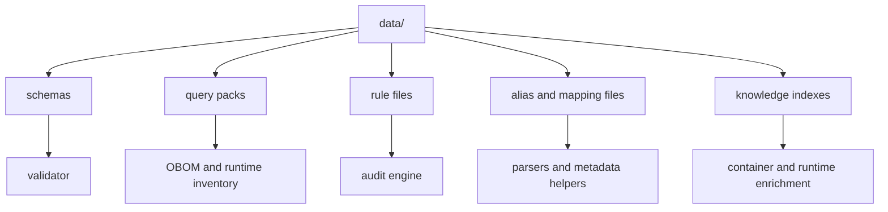
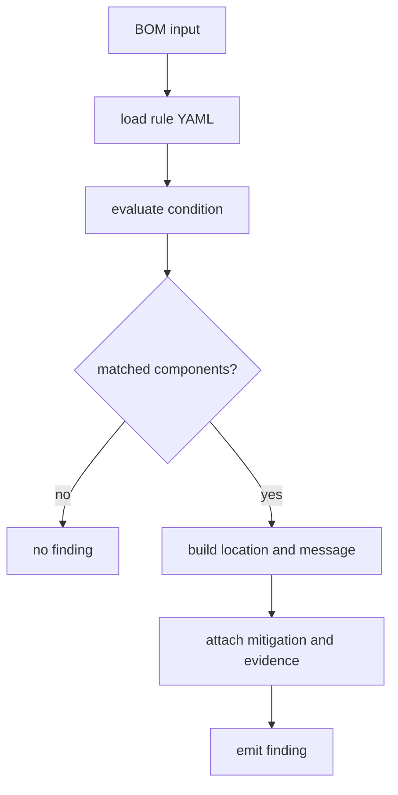

# Introduction

This directory contains static knowledge that cdxgen uses at runtime. Some files are passive reference data. Others directly shape behavior, especially query packs, rule files, schemas, aliases, and component-tag metadata.

## Purpose of this directory

Treat `data/` as product behavior, not as a convenient dump of reference files. If a file here is stale, incomplete, or incorrectly sourced, it can change runtime output, validation behavior, or audit findings.

## Contribution policy

Direct pull requests that only hand-edit curated data in `data/` are not accepted. Start with an issue or a broader change proposal that explains:

1. the upstream source of truth
2. whether the file is upstream, derived, or hand-curated
3. how it should be refreshed
4. what tests or validation prove the update is safe

Prefer adding or improving automation under `contrib/` over one-off manual edits.

## Directory contents

| Filename | Purpose | Source | Curation / refresh path |
|---|---|---|---|
| `bom-1.4.schema.json` | CycloneDX 1.4 JSON schema for legacy compatibility validation | CycloneDX specification schema | upstream-derived compatibility copy; active feature work should target 1.5–1.7 |
| `bom-1.5.schema.json` | CycloneDX 1.5 JSON schema for validation | CycloneDX specification schema | upstream-derived |
| `bom-1.6.schema.json` | CycloneDX 1.6 JSON schema for validation | CycloneDX specification schema | upstream-derived |
| `bom-1.7.schema.json` | CycloneDX 1.7 JSON schema for validation | CycloneDX specification schema | upstream-derived |
| `cbomosdb-queries.json` | osquery queries for identifying SSL packages in OS contexts | project-maintained query pack | hand-curated with tests; should evolve with query-pack review |
| `component-tags.json` | tags extracted from component descriptions for classification | project-maintained derived dataset | partially curated; automation opportunities remain |
| `container-knowledge-index.json` | reference knowledge for container analysis | project-maintained derived dataset | partially curated; automation opportunities remain |
| `cosdb-queries.json` | osquery queries useful for identifying OS packages for C | project-maintained query pack | hand-curated with tests |
| `crypto-oid.json` | OID mapping reference used for crypto-aware output | standards and project-maintained mapping inputs | curated compatibility dataset |
| `cryptography-defs.json` | cryptography inventory definitions | project-maintained definitions | curated; should be kept aligned with analyzer and CBOM logic |
| `frameworks-list.json` | string fragments used to classify framework components | project-maintained heuristics | hand-curated; good candidate for future automation |
| `gtfobins-index.json` | GTFOBins reference data used for Linux container and runtime executable enrichment | GTFOBins project data plus project normalization | derived and normalized for cdxgen |
| `known-licenses.json` | hard-coded license corrections | project-maintained compatibility fixes | hand-curated escape hatch; prefer upstream/source fixes when possible |
| `lic-mapping.json` | fallback license-name to identifier mapping | project-maintained mapping | hand-curated compatibility layer |
| `lolbas-index.json` | LOLBAS reference data used for Windows runtime findings | LOLBAS project data plus project normalization | derived and normalized for cdxgen |
| `predictive-audit-allowlist.json` | allowlist data for audit behavior | project-maintained heuristics | curated; should be reviewed alongside audit targeting logic |
| `pypi-pkg-aliases.json` | Python package-name alias data | project-maintained alias mapping | hand-curated compatibility layer |
| `python-stdlib.json` | Python standard-library entries that can be filtered out | Python stdlib references plus project normalization | derived list; automation opportunities remain |
| `queries.json` | Linux osquery query pack for OBOM and runtime inventory | project-maintained query pack | hand-curated with tests |
| `queries-win.json` | Windows osquery query pack | project-maintained query pack | hand-curated with tests |
| `queries-darwin.json` | macOS osquery query pack | project-maintained query pack | hand-curated with tests |
| `rules/` | built-in BOM audit rule packs in YAML | project-maintained rule packs | hand-authored rules validated by tests; users can also supply their own rule packs |
| `spdx-licenses.json` | SPDX license identifiers | SPDX License List data | upstream-derived |
| `spdx-export.schema.json` | SPDX 3.0.1 schema used during export validation | project-derived export schema generated from SPDX model artifacts | derived artifact; there is not a single upstream-published JSON schema that exactly matches this export use case |
| `spdx.schema.json` | SPDX schema for validation | SPDX JSON schema inputs used by the project | upstream-derived compatibility copy |
| `vendor-alias.json` | vendor or group-name alias fixes | project-maintained alias mapping | hand-curated compatibility layer; should eventually be reduced as heuristics improve |
| `wrapdb-releases.json` | Meson WrapDB release data | Meson WrapDB | derived artifact; refresh automation still needs to be formalized and maintained |

## How this directory fits into the architecture

### ASCII view

```text
runtime code
   |
   +--> lib/cli/* -----------> alias files, framework lists, tag maps
   |
   +--> lib/stages/postgen/* -> rule packs, standards data, schemas
   |
   +--> lib/audit/* ---------> rules/, allowlists, scoring support data
   |
   +--> lib/validator/* -----> CycloneDX and SPDX schemas
   |
   +--> OBOM flows ----------> queries*.json, GTFOBins, LOLBAS, knowledge indexes
```

### Mermaid view



## Query-pack files

The three `queries*.json` files are platform-specific osquery packs. They describe what cdxgen should ask osquery for when generating OS and runtime inventory.

### Query-pack shape

| Field | Required | Purpose |
|---|---|---|
| `query` | yes | SQL executed against osquery |
| `description` | yes | human-readable explanation of the collection intent |
| `purlType` | yes | package URL type used for derived components |
| `componentType` | no | CycloneDX component type when `library` is not appropriate |
| `name` | no | component-name override for result sets that do not naturally expose one |

### Example mental model

```text
queries.json entry
      |
      v
osquery runs SQL
      |
      v
rows come back
      |
      v
cdxgen maps rows into components using purlType and componentType
```

### Good query-pack hygiene

| Practice | Why it matters |
|---|---|
| keep descriptions specific | helps users understand collected categories |
| choose `componentType` carefully | affects how consumers interpret results |
| mirror cross-platform entries intentionally | reduces accidental platform drift |
| keep query scope safe and bounded | avoids expensive or unsafe collection |

## Rule files under `data/rules/`

Rule files are YAML packs consumed by the audit flow. Each file groups rules by a shared theme such as container risk, rootfs hardening, OBOM runtime posture, or AI agent governance.

### Rule evaluation flow

#### ASCII view

```text
input BOM
   |
   v
load YAML rule pack
   |
   v
for each rule
   |
   +--> evaluate JSONata condition against BOM
   +--> collect matching components
   +--> build location object
   +--> render message template
   +--> attach mitigation, evidence, ATT&CK, and standards metadata
   |
   v
audit findings
```

#### Mermaid view



## Rule schema in practice

Each rule is a YAML list item. These fields matter most.

| Field | Required | Purpose |
|---|---|---|
| `id` | yes | unique stable identifier such as `CTR-001` |
| `name` | yes | short title used in findings |
| `description` | yes | why the rule exists and what it detects |
| `severity` | yes | risk level such as `critical`, `high`, `medium`, `low`, `info` |
| `category` | yes | thematic category that usually aligns with the file grouping |
| `dry-run-support` | yes | whether the rule can work on dry-run style BOMs |
| `condition` | yes | JSONata expression that selects matching components |
| `location` | yes | JSONata expression that builds a location object for the match |
| `message` | yes | rendered finding text, including placeholders |
| `mitigation` | yes | remediation guidance shown with the finding |
| `evidence` | no | extra structured data carried with the finding |
| `attack` | no | MITRE ATT&CK mapping data |
| `standards` | no | mapping of standard names to reference identifiers; surfaced in audit annotations as `cdx:audit:standards:*` metadata |

## Writing `condition` expressions

Conditions are written in JSONata and evaluated against the BOM document. In practice, most rules filter the `components` array.

```yaml
condition: |
  components[
    $prop($, 'cdx:some:property') = 'expected-value'
    and type = 'library'
  ]
```

### Helper functions commonly used in rules

| Function | Purpose |
|---|---|
| `$prop(component, name)` | fetches a CycloneDX property by name |
| `$nullSafeProp(component, name)` | null-safe property fetch for comparisons |
| `$listContains(list, value)` | checks list-like property text for a specific entry |
| `$firstNonEmpty(a, b, ...)` | returns the first non-empty value |

### Thinking about rule conditions

A good condition is usually:

1. specific enough to avoid noise
2. readable enough for reviewers to reason about
3. based on stable properties that cdxgen already emits consistently

## Message rendering

The `message` field supports template placeholders using double braces.

```yaml
message: "Package '{{ name }}' at version '{{ version }}' is affected"
```

Those expressions are evaluated in the context of the matched component. Keep messages clear and reviewer-friendly. The message should explain the risk without requiring the reader to decode the raw JSONata condition.

## Authoring rules with the REPL

Use `cdxi` when you want a tight feedback loop while authoring or debugging a rule. A practical flow is:

```text
cdxi bom.json
.query components[type = 'library']
.query components[$prop($, 'cdx:github:action:isShaPinned') = 'false']
.auditfindings
.validate
```

Why this helps:

| REPL command | Use while authoring rules |
|---|---|
| `.query <jsonata>` | test the JSONata shape before copying it into a YAML rule |
| `.inspect <name-or-purl>` | inspect a concrete component when a condition is too broad or too narrow |
| `.auditfindings` | review existing annotations produced by `--bom-audit` or `cdx-audit` |
| `.validate` | quickly validate the loaded BOM before concluding the rule is wrong |

## Using custom rule packs

Users can maintain their own rule packs outside this repository and supply the directory at runtime.

```bash
# Apply custom rules during BOM generation
cdxgen --bom-audit --bom-audit-rules-dir ./my-rules -o bom.json

# Apply custom rules with the standalone audit command
cdx-audit --bom bom.json --direct-bom-audit --rules-dir ./my-rules
```

This is the preferred path for organization-specific policy rather than submitting narrowly scoped custom rules into `data/rules/`.

## Adding a new rule safely

Use this sequence.

1. choose the correct category file under `data/rules/`
2. draft the condition against a real BOM sample
3. keep the location object small and actionable
4. add mitigation text that tells the user what to do next
5. add or update tests in `lib/stages/postgen/auditBom.poku.js`

## Choosing between a rule, a query-pack entry, and a helper-data file

| If you need to add... | It probably belongs in... |
|---|---|
| a new risk detection idea over existing BOM fields | `data/rules/*.yaml` |
| a new host or runtime collection source | `queries*.json` |
| a new alias, mapping, or classifier list | another JSON file in `data/` |
| a new schema or validation artifact | `data/*schema*.json` |

## Automation and maintenance gaps

Some files in `data/` are still compatibility layers, hand-curated heuristics, or locally derived artifacts. The goal should be to reduce those hacks over time, not normalize them.

Current expectations:

1. open an issue before proposing a new refresh process or replacing a derived artifact
2. document the upstream source and whether the file is hand-curated, upstream, or locally derived
3. prefer a repeatable refresh script under `contrib/` where practical
4. keep tests close to any rule or query-pack change

`wrapdb-releases.json` remains a derived artifact, but its refresh path still needs to be formalized and maintained like the rest of the curated datasets. Those gaps should be tracked as issue-first follow-up work rather than solved with silent one-off edits.

## Maintenance advice

This directory changes slowly, but small mistakes here can affect a lot of runtime behavior. Treat edits as code, not content.

| Habit | Why it helps |
|---|---|
| keep examples close to real emitted fields | avoids stale rules |
| review platform symmetry for query packs | avoids one-OS regressions |
| test new rules with realistic BOM fixtures | catches false positives early |
| document new files here | keeps contributors oriented |
| replace hacks with sourced or scripted refresh paths when possible | keeps long-term maintenance manageable |
