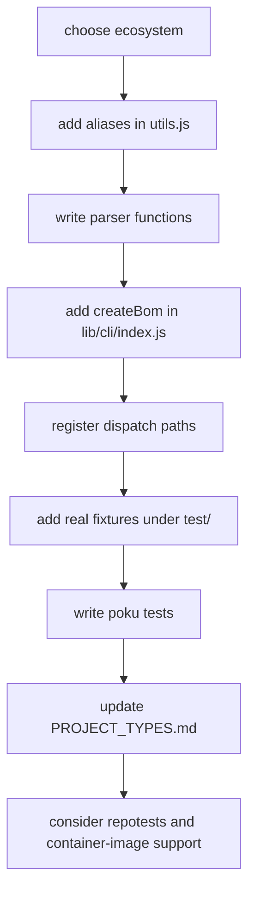
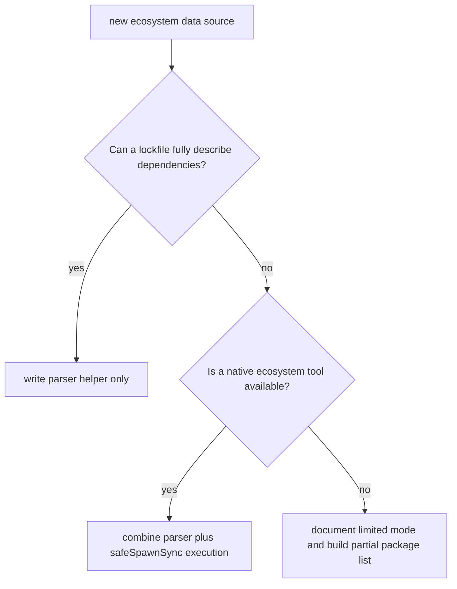

# Adding Support for a New Language or Ecosystem

This guide is for contributors who want to teach cdxgen how to understand a new language, package manager, or build format. It is intentionally practical. It names the files you will touch, explains why they matter, and shows an order that keeps the change small and reviewable.

## The shape of an ecosystem change

### ASCII touchpoint map

```text
new ecosystem support
   |
   +--> lib/helpers/utils.js
   |      +--> aliases
   |      +--> parser functions
   |
   +--> lib/cli/index.js
   |      +--> create<Language>Bom()
   |      +--> dispatch registration
   |
   +--> test/
   |      +--> real fixtures
   |
   +--> lib/**/*.poku.js
   |      +--> parser and generator tests
   |
   +--> docs/PROJECT_TYPES.md
   |      +--> user-facing discovery docs
   |
   +--> optional CI or image follow-up
          +--> .github/workflows/repotests.yml
          +--> ci/ images if special SDKs are needed
```

### Mermaid workflow



## Before you write code

Start by answering these questions.

| Question                                                    | Why it matters                                        |
| ----------------------------------------------------------- | ----------------------------------------------------- |
| Is the ecosystem already supported under a different alias? | avoids duplicate project types                        |
| Does a lockfile already contain everything needed?          | determines whether you need package-manager execution |
| Does the ecosystem require a native tool or SDK?            | affects containers, CI, and secure-mode expectations  |
| Does the output need custom purl behavior?                  | affects package identity and deduplication            |

The first place to check is `lib/helpers/utils.js`, especially `PROJECT_TYPE_ALIASES`.

## Working with an AI agent

If you want an AI agent to help with a new ecosystem contribution, start with [AI Prompt for New Ecosystem Contributions](AI_ECOSYSTEM_PROMPT.md). It turns the expectations from this guide into a review-friendly prompt template.

## Step 1: Define the user-facing type names

Add the canonical type and its accepted aliases to `PROJECT_TYPE_ALIASES` in `lib/helpers/utils.js`.

```js
export const PROJECT_TYPE_ALIASES = {
  // existing entries
  mylang: ["mylang", "mypkgmanager", "myalias"],
};
```

This step does three jobs at once:

1. it teaches `--type` what names are valid
2. it lets the type participate in `hasAnyProjectType()` checks
3. it keeps filtering and exclusion behavior consistent with the rest of the codebase

If the package manager needs its own alias set, also update `PACKAGE_MANAGER_ALIASES` in the same file.

## Step 2: Decide where parsing logic belongs

In cdxgen, most lightweight manifest and lockfile parsing lives in `lib/helpers/utils.js`. Add a new helper module only when the logic is large enough to deserve its own file or when it has a distinct responsibility.

### Parser decision diagram



When you create parser functions, keep these conventions:

| Convention                                           | Reason                                                      |
| ---------------------------------------------------- | ----------------------------------------------------------- |
| return arrays, usually empty arrays on missing files | callers expect non-throwing parser behavior                 |
| use `PackageURL` for purls                           | string concatenation is fragile and discouraged             |
| use `safeExistsSync` and `safeSpawnSync`             | keeps secure-mode and command-allowlist behavior consistent |
| accept `options` when behavior depends on CLI flags  | keeps library code detached from `process.argv`             |

## Step 3: Build package objects that fit the rest of cdxgen

Your parser does not need to assemble a full CycloneDX document. It does need to return package records that `buildBomNSData()` can understand.

A typical component-like package record contains:

| Field        | Typical purpose                                                                          |
| ------------ | ---------------------------------------------------------------------------------------- |
| `name`       | package name                                                                             |
| `version`    | resolved version                                                                         |
| `purl`       | stable package identity                                                                  |
| `bom-ref`    | component reference, often aligned with the purl                                         |
| `type`       | usually `library`, sometimes `framework`, `application`, or another valid CycloneDX type |
| `scope`      | often `required` for direct dependencies                                                 |
| `properties` | extra source context such as manifest path                                               |

If the ecosystem has lockfile-only data with no dependency tree, start there. cdxgen already has several ecosystems where the initial implementation is manifest-first and a later contribution deepens it.

## Step 4: Add `create<Language>Bom()` in `lib/cli/index.js`

Add a generator function in `lib/cli/index.js` that follows the existing pattern.

```js
export async function createMylangBom(path, options) {
  let pkgList = [];
  let dependencies = [];
  let parentComponent = {};

  // discover files
  // parse manifests or lockfiles
  // optionally call the native toolchain
  // optionally enrich metadata

  return buildBomNSData(options, pkgList, "mylang", {
    src: path,
    dependencies,
    parentComponent,
  });
}
```

This function is where ecosystem-specific orchestration belongs. It is not where final once-per-BOM behavior belongs.

## Step 5: Register dispatch paths

A new generator is not reachable until you wire it into the dispatch flow.

There are usually two places to check in `lib/cli/index.js`:

1. the path that handles a single project type
2. the path that participates in multi-type scans

The exact structure changes over time, so search for nearby ecosystem cases rather than relying on fixed line numbers.

### Dispatch mental model

```text
requested type or detected manifest
          |
          v
  createBom() decides mode
          |
          v
createXBom() or createMultiXBom()
          |
          v
  your createMylangBom()
```

## Step 6: Handle parent components and dependency edges carefully

Not every ecosystem needs custom dependency-edge handling, but some do. Use existing implementations as examples.

| Situation                                           | What to do                                                     |
| --------------------------------------------------- | -------------------------------------------------------------- |
| the ecosystem can provide a full dependency graph   | populate `dependencies` and pass it into `buildBomNSData()`    |
| the ecosystem only provides a flat list             | start with components only and add graph support later         |
| the scan produces a top-level application component | populate `parentComponent` appropriately                       |
| the ecosystem contributes formulation-only data     | attach it to the BOM result so post-processing can add it once |

## Step 7: Add real fixtures under `test/`

Good ecosystem support starts with honest fixture files. Add representative manifests or lockfiles to `test/`.

Choose fixtures that cover:

| Fixture type            | Why it helps                                         |
| ----------------------- | ---------------------------------------------------- |
| normal project          | confirms the happy path                              |
| small edge case         | captures the format quirk that motivated the feature |
| missing or minimal file | proves the parser fails gently                       |

## Step 8: Write poku tests close to the code

cdxgen uses co-located `*.poku.js` files under `lib/`. That gives reviewers a tight loop between implementation and tests.

A typical change usually needs two kinds of tests:

1. parser tests that validate raw lockfile or manifest handling
2. generator tests that validate returned BOM data and any toolchain stubbing

If the generator shells out, stub `safeSpawnSync` with `esmock` and `sinon` rather than calling the real toolchain.

## Step 9: Update user-facing documentation

At minimum, update `docs/PROJECT_TYPES.md` so users know:

| Detail to add       | Example                                |
| ------------------- | -------------------------------------- |
| canonical type      | `mylang`                               |
| accepted aliases    | `mypkgmanager`, `myalias`              |
| discovery files     | `mylang.lock`, `mylang.toml`           |
| notable limitations | lockfile only, no transitive graph yet |

## Step 10: Consider CI and container support

Some ecosystems are easy to merge because the parser is pure JavaScript. Others need extra runtime support.

Use this checklist.

| Follow-up area   | Ask yourself                                                                           |
| ---------------- | -------------------------------------------------------------------------------------- |
| repotests        | is there a stable public repository worth adding to `.github/workflows/repotests.yml`? |
| container images | does the default image already include the SDK or toolchain?                           |
| secure mode      | does your implementation degrade safely when process execution is restricted?          |
| docs             | will users understand limitations and prerequisites from the docs alone?               |

## A practical order that keeps the PR reviewable

If you want the cleanest review, work in this order:

1. aliases and parser helpers
2. tests for the parser
3. generator wiring
4. generator tests
5. docs and any CI follow-up

That order lets reviewers trust each layer before they look at the next one.

## Common mistakes to avoid

| Mistake                                             | Why it hurts                                 |
| --------------------------------------------------- | -------------------------------------------- |
| reading `process.argv` in a parser                  | breaks the `options` contract                |
| constructing purls by hand                          | creates inconsistent refs and parsing errors |
| putting once-per-BOM logic in `buildBomNSData()`    | repeats the effect for every project type    |
| importing `lib/cli/index.js` from a helper or stage | breaks layering rules                        |
| omitting fixtures                                   | makes parser regressions hard to catch       |

## Final checklist

1. aliases added in `PROJECT_TYPE_ALIASES`
2. parser helper added in `lib/helpers/`
3. `create<Language>Bom()` added in `lib/cli/index.js`
4. dispatch registration completed
5. fixtures added under `test/`
6. poku coverage added
7. `docs/PROJECT_TYPES.md` updated
8. optional repotest and image follow-up considered

## Related pages

- [Architecture Overview](ARCHITECTURE.md)
- [Testing Guide](TESTING.md)
- [Supported Project Types](PROJECT_TYPES.md)
- [AI Prompt for New Ecosystem Contributions](AI_ECOSYSTEM_PROMPT.md)
