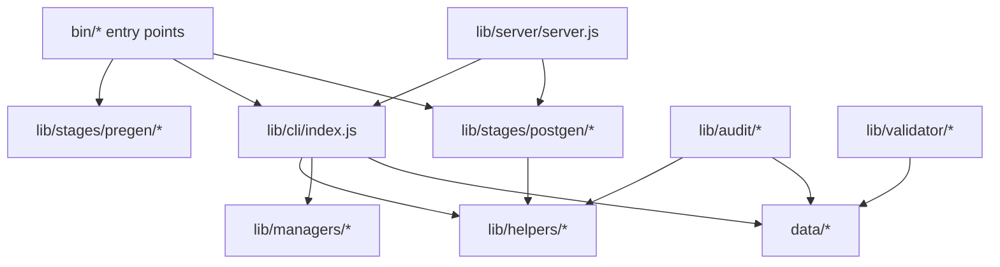
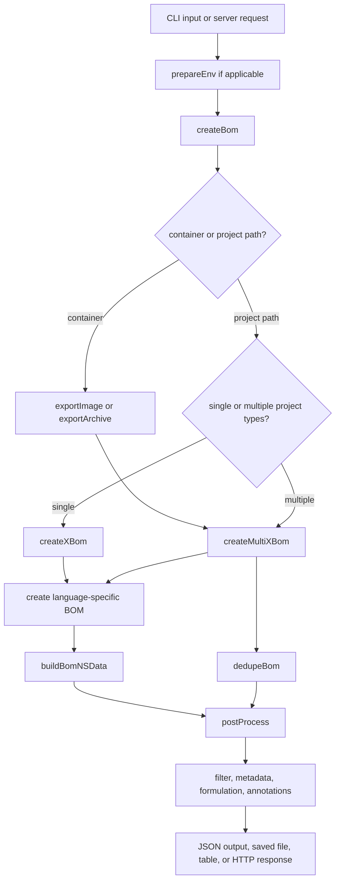

# Architecture Overview

This page gives contributors a stable mental model for how cdxgen is organized without forcing every detail into one file. It explains the main layers, the command entry points, and where different categories of changes belong.

If you want concrete, language-specific examples from the real implementation, read [Architecture Implementation Examples](ARCHITECTURE_ECOSYSTEM_EXAMPLES.md).

If you want to understand where user-facing features such as dry-run mode, BOM audit, predictive audit, and validation are already documented, read [Feature Coverage Map](FEATURE_COVERAGE.md).

If you want a contributor-focused explanation of how secure mode and dry-run mode change the architecture, read [Architecture Under Secure Mode and Dry-Run Mode](ARCHITECTURE_EXECUTION_MODES.md).

## Core mental model

A good way to think about cdxgen is:

1. `bin/` turns user intent into an `options` object.
2. `lib/cli/index.js` decides what kind of target is being scanned and assembles raw BOM data.
3. `lib/stages/postgen/` runs the once-per-BOM shaping pass.
4. sibling command entry points such as `cdx-audit`, `cdx-validate`, `cdx-convert`, `cdx-sign`, and `cdx-verify` build on that output or adjacent rule engines.

## Repository map

| Path | Main role | Reach for it when you need to... |
|---|---|---|
| `bin/` | CLI entry points | add or change command-line flags, startup flow, or output behavior |
| `.github/` | Repository automation | change workflows, templates, issue forms, or release automation |
| `lib/cli/index.js` | Core BOM generation | add ecosystems, change detection, or alter BOM assembly |
| `lib/helpers/` | Shared helpers and parsers | add lockfile parsing, metadata helpers, or reusable utilities |
| `contrib/` | Helper scripts and one-off maintenance tools | document or extend refresh utilities that are not part of the runtime package |
| `lib/stages/pregen/` | Environment preparation | change SDK installation or preflight behavior |
| `lib/stages/postgen/` | Final BOM shaping | change filtering, standards, metadata, formulation, or annotations |
| `lib/managers/` | Domain-specific managers | change Docker, OCI, binary, or package-manager integration |
| `lib/audit/` | Predictive audit engine | change upstream audit logic, rules, scoring, or reporting |
| `lib/server/` | HTTP server | change server-side request handling or long-lived scan behavior |
| `lib/validator/` | Validation | change CycloneDX or SPDX validation behavior |
| `data/` | Static runtime data | add schemas, query packs, rule packs, aliases, or classifier data |
| `test/` | Fixtures | add sample manifests, lock files, or audit inputs |
| `docs/` | Documentation | document behavior, contributor guidance, and troubleshooting |
| `types/` | Generated types | do not edit manually |

## Architecture in one screen

### ASCII layering diagram

```text
                        +----------------------+
                        |  bin/* entry points   |
                        |  cdxgen, audit, ...   |
                        +----------+-----------+
                                   |
                                   v
                        +----------------------+
                        |  lib/cli/index.js    |
                        | createBom()          |
                        | createXBom()         |
                        | createMultiXBom()    |
                        +----------+-----------+
                                   |
                  +----------------+----------------+
                  |                                 |
                  v                                 v
        +----------------------+         +----------------------+
        |   lib/helpers/*      |         | lib/stages/postgen/* |
        | parsers, utils,      |         | filter, metadata,    |
        | metadata helpers     |         | formulation, annotate|
        +----------------------+         +----------------------+
                  |
                  v
        +----------------------+
        |  lib/managers/*      |
        | Docker, OCI, pip     |
        +----------------------+
```

### Mermaid layering diagram



## Runtime flow from command line to BOM

### ASCII runtime flow

```text
user command
   |
   v
bin/cdxgen.js
   |
   +--> prepareEnv()              optional SDK and tool preparation
   |
   +--> createBom()
           |
           +--> exportImage()/exportArchive() when needed
           +--> createXBom() for single-type detection
           +--> createMultiXBom() for multi-type or OCI scans
           +--> create<Language>Bom() per ecosystem
           +--> buildBomNSData()
           +--> dedupeBom()
   |
   v
postProcess()
   |
   +--> filterBom()
   +--> applyStandards()
   +--> applyMetadata()
   +--> applyFormulation()
   +--> annotate()
   |
   v
write BOM / print summary / return HTTP response
```

### Mermaid runtime flow



## Command surface and responsibilities

The repository is not only one generator command.

| Command | Entry point | Primary responsibility |
|---|---|---|
| `cdxgen` | `bin/cdxgen.js` | generate CycloneDX or SPDX-oriented BOM output from source, images, archives, git URLs, or purls |
| `hbom` | `bin/hbom.js` | generate hardware BOMs using the optional HBOM collector |
| `cdx-audit` | `bin/audit.js` | run predictive dependency audit from existing BOMs |
| `cdx-validate` | `bin/validate.js` | run schema, deep, and compliance validation |
| `cdx-convert` | `bin/convert.js` | convert CycloneDX to SPDX |
| `cdx-sign` | `bin/sign.js` | sign BOMs |
| `cdx-verify` | `bin/verify.js` | verify BOM signatures |
| `evinse` | `bin/evinse.js` | enrich BOMs with evidence and service data |
| `cdxi` | `bin/repl.js` | interactive exploration and server-adjacent workflows |

## The most important boundary to remember

The strongest architectural rule in cdxgen is the layering rule.

| Layer | May import from | Must not import from |
|---|---|---|
| `lib/helpers/*` | npm packages, `node:*`, local helper modules | `lib/cli/*`, `lib/stages/*`, `bin/*` |
| `lib/cli/*` | helpers, managers, parsers, data | `bin/*` |
| `lib/stages/postgen/*` | helpers, data | `lib/cli/index.js` |
| `bin/*` and `lib/server/*` | cli, stages, helpers | lower layers importing back upward |

If you are about to import `../../cli/index.js` inside a helper or stage file, stop and move the shared logic into `lib/helpers/` first.

## Where common changes belong

| Change you want | First place to inspect |
|---|---|
| Add a new `--flag` or `--feature-flags` entry | `bin/cdxgen.js` |
| Add a new ecosystem | `lib/cli/index.js` and `lib/helpers/utils.js` |
| Add a new query-pack table | `data/queries*.json` |
| Add a new audit rule | `data/rules/*.yaml` and `lib/stages/postgen/auditBom.poku.js` |
| Change filtering behavior | `lib/stages/postgen/postgen.js` |
| Change release-note logic | `lib/stages/postgen/postgen.js` and the helpers it calls |
| Change container export behavior | `lib/managers/docker.js` or `lib/managers/oci.js` |
| Change validation behavior | `lib/validator/` |
| Change predictive audit behavior | `lib/audit/` and audit docs |

## The `options` object as the shared contract

Nearly every public entry point accepts the same `options` object. That object originates in the CLI, flows into `createBom()`, continues into per-language generators, and is reused in post-processing.

That means a feature is usually easiest to add when you thread it through `options` once and read it where needed, rather than inferring CLI intent deep inside library code.

## Related deep dives

- [Architecture Implementation Examples](ARCHITECTURE_ECOSYSTEM_EXAMPLES.md)
- [BOM Generation Pipeline](BOM_PIPELINE.md)
- [Architecture Under Secure Mode and Dry-Run Mode](ARCHITECTURE_EXECUTION_MODES.md)
- [BOM Pipeline Examples](BOM_PIPELINE_EXAMPLES.md)
- [Feature Coverage Map](FEATURE_COVERAGE.md)
- [Adding a New Language or Ecosystem](ADD_ECOSYSTEM.md)
- [Testing Guide](TESTING.md)
