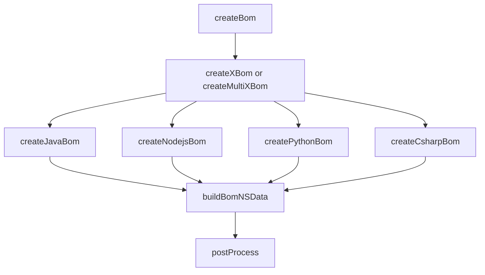
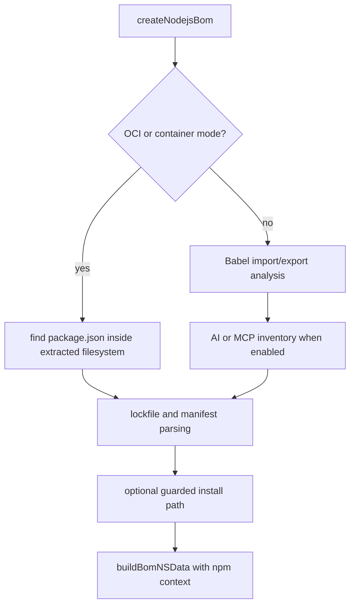
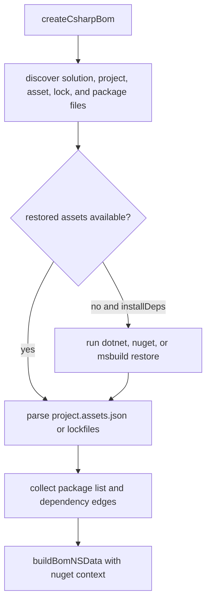

# Architecture Implementation Examples

This page complements [Architecture Overview](ARCHITECTURE.md) by showing how the design looks in real code paths. The examples below are drawn from the current implementations in `lib/cli/index.js`.

## Shared pattern across ecosystems

### Mermaid overview



### ASCII overview

```text
createBom()
   |
   +--> createXBom() / createMultiXBom()
   |      +--> createJavaBom()
   |      +--> createNodejsBom()
   |      +--> createPythonBom()
   |      +--> createCsharpBom()
   |
   +--> buildBomNSData()
   |
   +--> postProcess()
```

## Java and JVM example

`createJavaBom()` is a good example of how one ecosystem can support multiple acquisition strategies under one entry point.

### What it actually does

| Implementation detail | Current behavior |
|---|---|
| archive support | handles `.war` and `.jar` inputs directly, extracting packages before BOM assembly |
| project discovery | scans for `pom.xml`, `build.gradle*`, and `build.mill` |
| framework-specific behavior | detects Quarkus by parsing early POM files and switches strategy |
| tool invocation | can use the CycloneDX Maven plugin or Maven dependency-tree style collection |
| deep analysis support | collects JAR namespace mappings when class resolution or deep mode is enabled |
| BOM assembly | returns through `buildBomNSData(options, pkgList, "maven", context)` |

### ASCII trace

```text
createJavaBom(path, options)
   |
   +--> .jar/.war input?
   |      +--> extract archive
   |      +--> get Maven metadata
   |
   +--> pom.xml / gradle / mill discovery
   +--> detect Quarkus or regular Maven path
   +--> run plugin or dependency-tree collection
   +--> collect metadata and dependencies
   +--> buildBomNSData(..., "maven", ...)
```

### Why it matters architecturally

Java demonstrates why cdxgen keeps ecosystem orchestration inside `create<Language>Bom()` instead of trying to force everything through one generic parser. The same public entry point can cover archives, Maven, Quarkus, Gradle-adjacent detection, and deep class-resolution helpers while still emitting a common result shape.

## JavaScript and Node.js example

`createNodejsBom()` is the broadest example of a mixed static-analysis and manifest-analysis flow.

### What it actually does

| Implementation detail | Current behavior |
|---|---|
| container-aware path | when scanning OCI or OS-like targets, it can enumerate `package.json` files inside extracted content |
| source analysis | optionally performs Babel-based import/export analysis for non-container source trees |
| AI and MCP inventory | can collect AI skill, instruction, and MCP inventory alongside package data |
| manifest support | scans `package.json`, `package-lock.json`, `yarn.lock`, `pnpm-lock.yaml`, `bower.json`, and `*min.js` |
| install heuristics | may run a guarded install path for smaller projects missing lockfiles, always with `--ignore-scripts` |
| BOM assembly | returns through `buildBomNSData(options, pkgList, "npm", context)` |

### Mermaid example flow



### Why it matters architecturally

Node.js shows how one generator can combine several layers of evidence: static source imports, lockfiles, generated dependency trees, archive-style assets such as minified JavaScript, and AI inventory. The architecture works because these concerns still converge into the same `pkgList`, `dependencies`, and `parentComponent` contract before `buildBomNSData()` runs.

## Python example

`createPythonBom()` is a good example of one function supporting several packaging workflows without pretending they are identical.

### What it actually does

| Implementation detail | Current behavior |
|---|---|
| alternate front door | short-circuits into `createPixiBom()` when Pixi files are present |
| lockfile support | understands Poetry, PDM, uv, and generic `pylock*.toml` inputs |
| requirements support | falls back to `requirements*.txt` and `requirements/*.txt` when lockfile-first paths are absent |
| metadata shaping | extracts a parent component from `pyproject.toml` and attaches `SrcFile` metadata |
| deeper tree option | can build a frozen dependency tree when installs are allowed |
| safer fallback | can use export-based flows such as `poetry export` or `pdm export` when install-time behavior is not desired |
| formulation support | collects formulation items from deeper Python environment resolution |
| BOM assembly | returns through `buildBomNSData(options, pkgList, "pypi", context)` |

### ASCII trace

```text
createPythonBom(path, options)
   |
   +--> pixi.toml / pixi.lock ?
   |      +--> createPixiBom()
   |
   +--> poetry / pdm / uv / pylock discovery
   +--> pyproject.toml parent component parsing
   +--> requirements fallback when needed
   +--> optional pip frozen tree or export fallback
   +--> collect dependencies and formulation data
   +--> buildBomNSData(..., "pypi", ...)
```

### Why it matters architecturally

Python shows why the architecture benefits from a generous context object. The generator may need to carry dependencies, parent metadata, and formulation data forward together, even though those pieces come from different Python toolchains.

## .NET / NuGet example

The .NET path lives in `createCsharpBom()`. It is the best example of a generator that has to bridge project files, restored assets, and multiple restore tools.

### What it actually does

| Implementation detail | Current behavior |
|---|---|
| file discovery | scans `*.sln`, `*.{cs,vb,fs,ts,hmi,plc}proj`, `packages.config`, `project.assets.json`, `packages.lock.json`, `paket.lock`, and `*.nupkg` |
| build-tool hinting | can inspect target frameworks and print framework suggestions |
| restore strategy | runs `dotnet restore`, `nuget restore`, or `msbuild -t:restore` depending on project type and platform |
| compatibility guidance | prints targeted advice when SDK, NuGet, or private feed problems are detected |
| asset parsing | reads restored assets and lockfiles to build package and dependency data |
| package fallback | can parse `.nupkg` files when restored assets are absent |
| BOM assembly | returns through `buildBomNSData(options, pkgList, "nuget", context)` |

### Mermaid example flow



### Why it matters architecturally

The .NET path is a good reminder that cdxgen often documents not only successful parsing but also restore-time guidance. The generator is expected to help operators recover from missing SDK versions, private feed problems, and platform mismatches while still fitting the same final BOM contract.

## Cross-cutting lesson

Across Java, JavaScript, Python, and .NET, the same architectural pattern holds:

1. discover ecosystem-specific inputs
2. choose safe or practical acquisition paths
3. collect `pkgList`, `dependencies`, and parent metadata
4. emit one normalized result through `buildBomNSData()`
5. let `postProcess()` do the once-per-BOM work

That separation is what keeps polyglot scans and feature additions manageable.

## Related pages

- [Architecture Overview](ARCHITECTURE.md)
- [BOM Generation Pipeline](BOM_PIPELINE.md)
- [BOM Pipeline Examples](BOM_PIPELINE_EXAMPLES.md)
