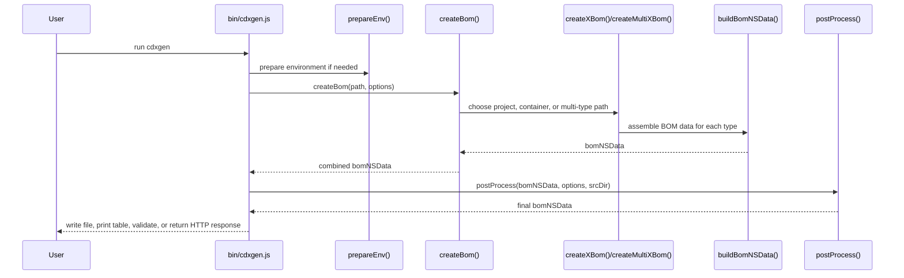
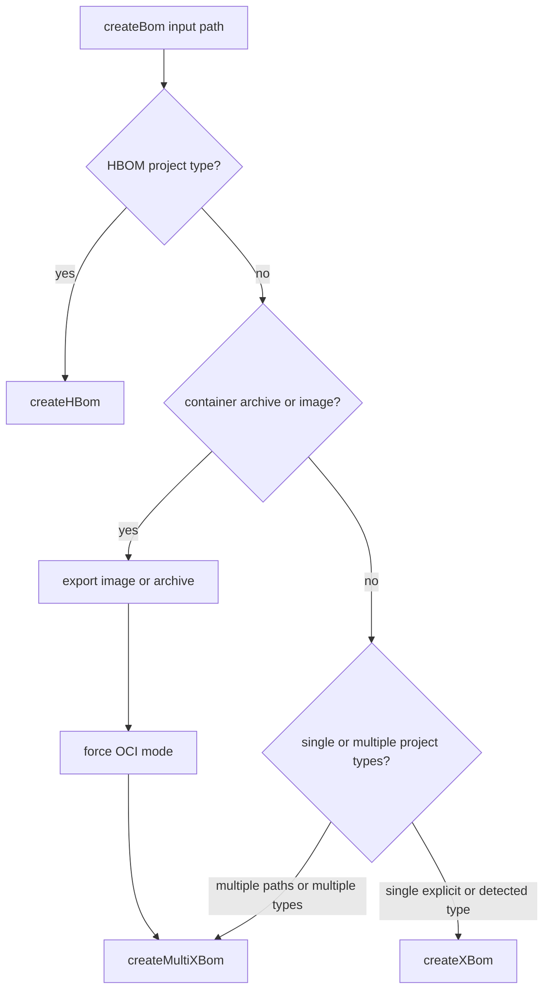

# BOM Generation Pipeline

This page explains what happens during a cdxgen run from input discovery to final JSON. It focuses on the shared pipeline that almost every `cdxgen` execution follows.

If you want concrete, language-specific examples drawn from the real generator implementations, read [BOM Pipeline Examples](BOM_PIPELINE_EXAMPLES.md).

If you want a map of dry-run mode, BOM audit, predictive audit, validation, and related commands, read [Feature Coverage Map](FEATURE_COVERAGE.md).

## The short version

A typical `cdxgen` run moves through five stages:

1. normalise the input and prepare the environment
2. decide whether the target is a project, a container image, an archive, or a host-oriented mode
3. discover supported manifests and lock files
4. assemble one or more language-specific BOM fragments
5. run one final post-processing pass and emit output

## Pipeline at a glance

### ASCII pipeline

```text
user input
   |
   +--> local directory
   |      |
   |      +--> prepareEnv()
   |      +--> createBom()
   |              +--> createXBom() or createMultiXBom()
   |              +--> create<Language>Bom()
   |              +--> buildBomNSData()
   |
   +--> container reference or archive
   |      |
   |      +--> exportImage()/exportArchive()
   |      +--> createMultiXBom()
   |
   +--> purl or git-style source
          |
          +--> resolve source
          +--> treat as a normal scan target

all paths converge into:

postProcess()
   |
   +--> filterBom()
   +--> applyStandards()
   +--> applyMetadata()
   +--> applyFormulation()
   +--> annotate()
   |
   v
final CycloneDX JSON and optional output transforms
```

### Mermaid sequence diagram



## Step 1: Input normalisation and environment preparation

The CLI accepts more than one style of input.

| Input style | What cdxgen does first |
|---|---|
| local source directory | prepares SDKs and scans for manifests |
| container image reference | exports the image before dependency extraction |
| container archive (`.tar`, `.tar.gz`) | explodes the archive into layers and treats it as OCI input |
| purl source reference | resolves it to a source repository first |
| HBOM-oriented mode | routes to the dedicated hardware collector path |

In standard CLI usage, `bin/cdxgen.js` calls `prepareEnv(srcDir, options)` before `createBom()`. `prepareEnv()` is synchronous and may install or configure required tools for Python, Node.js, Swift, Ruby, or SDKMAN-managed Java versions.

That means the first class of failures often happens before BOM generation itself has started.

## Step 2: Mode selection inside `createBom()`

`createBom()` in `lib/cli/index.js` is the top-level dispatcher.

Its first job is not language detection. Its first job is deciding what kind of thing the input represents.

### Mode decision diagram



Container mode is important because it short-circuits several source-project assumptions. In that path, `createBom()` switches to OCI-style handling, disables dependency installation, establishes parent container metadata, and passes exploded layer paths into the multi-type flow.

## Step 3: Project-type detection and manifest discovery

For project directories, `createXBom()` detects ecosystems by looking for known manifests and lock files.

| Ecosystem family | Typical detection files |
|---|---|
| Node.js | `package.json`, `rush.json`, `yarn.lock` |
| Java and JVM | `pom.xml`, `build.gradle*`, `build.sbt`, `build.mill` |
| Python | `pyproject.toml`, `poetry.lock`, `Pipfile`, `requirements*.txt`, `*.whl` |
| Go | `go.mod`, `go.sum`, `Gopkg.lock` |
| Rust | `Cargo.toml`, `Cargo.lock` |
| .NET | `*.sln`, `*.csproj`, `project.assets.json`, `packages.lock.json`, `paket.lock` |
| PHP | `composer.json`, `composer.lock` |

Filtering options affect discovery before generation starts:

| Option | Effect |
|---|---|
| `-t` / `--type` | narrows generation to selected project types |
| `--exclude-type` | prevents matching types from running |
| `--include-regex` | narrows manifest search to matching paths |
| `--exclude` | removes paths from discovery |
| recursion controls | change how broadly the tree is searched |

## Step 4: Per-language BOM assembly

Once a project type has been selected, cdxgen calls a specific generator such as `createJavaBom()`, `createNodejsBom()`, `createPythonBom()`, or `createCsharpBom()`.

Each of those functions follows the same broad pattern:

1. locate relevant manifests and lock files
2. parse them into a package list
3. optionally invoke the ecosystem toolchain to get a deeper tree
4. optionally fetch metadata or perform source analysis
5. pass the result to `buildBomNSData()`

### Per-language flow

```text
create<Language>Bom(path, options)
   |
   +--> find files for that ecosystem
   +--> parse lockfile or manifest
   +--> optionally run package-manager command
   +--> optionally enrich with registry metadata or source analysis
   +--> buildBomNSData(options, pkgList, projectType, context)
```

The most important contributor detail here is that `buildBomNSData()` is called once per language type, not once per final BOM. If a scan includes Java, JavaScript, Python, and .NET, it is called four times.

## Step 5: Multi-type merge and deduplication

When `createMultiXBom()` is used, cdxgen walks the provided paths and relevant project types, collects components and dependency edges into shared arrays, and then calls `dedupeBom()` at the end.

### ASCII merge view

```text
path A + js scan   ----+
path A + java scan --+ |
path B + py scan   ----|-+--> combined components[]
path B + dotnet    ----+ |    combined dependencies[]
                        |
                        +--> dedupeBom()
                                |
                                v
                         merged bomNSData
```

This matters because repeated side effects do not belong in `buildBomNSData()`. They belong in the shared post-processing phase that runs once.

## Step 6: Post-processing

After `createBom()` returns, the CLI calls `postProcess(bomNSData, options, srcDir)`.

This is where cdxgen performs its once-per-BOM work in a fixed order:

| Order | Function | Purpose |
|---|---|---|
| 1 | `filterBom()` | applies include, exclude, confidence, required-only, and related filters |
| 2 | `applyStandards()` | merges standards templates into the BOM when `--standard` is used |
| 3 | `applyMetadata()` | rewrites source-file evidence to relative paths and adds summary metadata properties |
| 4 | `applyContainerInventoryMetadata()` | adds container unpackaged-file summary counts where relevant |
| 5 | `applyFormulation()` | adds formulation data such as build tools and git context |
| 6 | `applyReleaseNotes()` | computes release notes when enabled |
| 7 | `applySpecVersionCompatibility()` | downgrades newer fields when emitting older CycloneDX spec versions |
| 8 | `validateTlpClassification()` | enforces TLP-related metadata rules |
| 9 | `annotate()` | adds annotations when the spec version supports them |

### What each post-process step really does

| Function | Implementation detail from the current code |
|---|---|
| `filterBom()` | removes excluded inventory types, filters on confidence/technique/purl/property matches, rebuilds retained `dependencies[]`, and can emit incomplete `compositions[]` for filtered outputs |
| `applyStandards()` | loads template data from `data/templates/*.cdx.json` and merges standard definitions and metadata licenses into the current BOM |
| `applyMetadata()` | converts `SrcFile` and evidence paths to relative values, then adds `cdx:bom:componentTypes`, `cdx:bom:componentNamespaces`, and `cdx:bom:componentSrcFiles` metadata properties |
| `applyContainerInventoryMetadata()` | computes `cdx:container:unpackagedExecutableCount` and `cdx:container:unpackagedSharedLibraryCount` from the assembled component list |
| `applyFormulation()` | attaches once-per-BOM formulation entries, including build and source context collected earlier in the pipeline |
| `applyReleaseNotes()` | when `--include-release-notes` is enabled, computes release notes from git context and stores them on the cdxgen tool component |
| `applySpecVersionCompatibility()` | strips or reshapes fields that are newer than the requested output spec version, including 1.6/1.7-only metadata and some crypto/evidence fields |
| `validateTlpClassification()` | checks TLP labeling rules before output leaves the generator |
| `annotate()` | creates or extends CycloneDX annotations for metadata and other derived context when the document spec version is high enough |

If you are trying to understand why a component disappeared, why formulation only appears once, or why paths were normalised, this is the phase to inspect.

## Step 7: Validation and optional conversion

Validation happens after post-processing in `bin/cdxgen.js`, not inside `postProcess()` itself.

### Validation flow

```text
createBom()
   |
   +--> postProcess()
   |
   +--> validateBom() when --validate is enabled
   |
   +--> convertCycloneDxToSpdx() when SPDX output is requested
   |      +--> validateSpdx() when --validate is still enabled
   |
   +--> write outputs
```

| Stage | What happens |
|---|---|
| CycloneDX validation | `validateBom(bomNSData.bomJson)` runs when `options.validate` is true; failure exits the CLI with a non-zero status |
| SPDX conversion | `convertCycloneDxToSpdx()` runs only after a CycloneDX BOM exists and SPDX output was requested |
| SPDX validation | `validateSpdx()` runs on the converted SPDX document when validation is enabled |
| dry-run interaction | dry-run blocks SPDX conversion output because the export path is intentionally read-only |

## Related execution modes

The shared pipeline above is often combined with adjacent features.

| Feature or mode | Where it hooks in |
|---|---|
| `--dry-run` | constrains side effects before and during generation |
| `--bom-audit` | evaluates the generated BOM after post-processing |
| predictive dependency audit | runs when BOM audit selects supported upstream targets |
| `--validate` | validates the final BOM before optional export or submission |
| SPDX export | converts the generated and optionally validated CycloneDX BOM |

Those features are documented in more depth in [Feature Coverage Map](FEATURE_COVERAGE.md).

## Where different classes of errors originate

| What you see | Most likely phase | What it usually means |
|---|---|---|
| missing SDK or package manager | environment preparation | the machine or image lacks a required tool |
| no manifests found | discovery | the directory is wrong, filtering is too broad, or the type was misdetected |
| shallow dependency tree | per-language assembly | the package-manager command failed or only a lockfile was available |
| duplicate or missing components after merge | multi-type merge | overlapping scans produced duplicates and dedupe logic collapsed them |
| components unexpectedly absent in final JSON | post-processing | filters or spec-compatibility changes removed or transformed them |
| audit findings after a clean build | audit or validation stage | the BOM was generated but policy or compliance checks flagged it |

## Related pages

- [BOM Pipeline Examples](BOM_PIPELINE_EXAMPLES.md)
- [Architecture Overview](ARCHITECTURE.md)
- [Architecture Implementation Examples](ARCHITECTURE_ECOSYSTEM_EXAMPLES.md)
- [Feature Coverage Map](FEATURE_COVERAGE.md)
- [Troubleshooting Common Issues](TROUBLESHOOTING.md)
- [Scanning Large and Complex Projects](MONOREPO.md)
