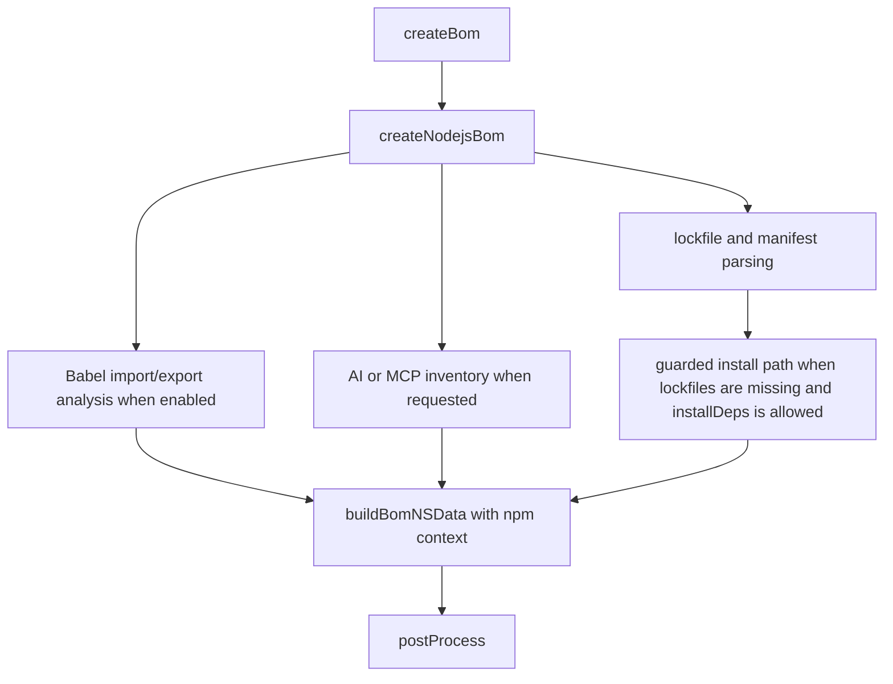
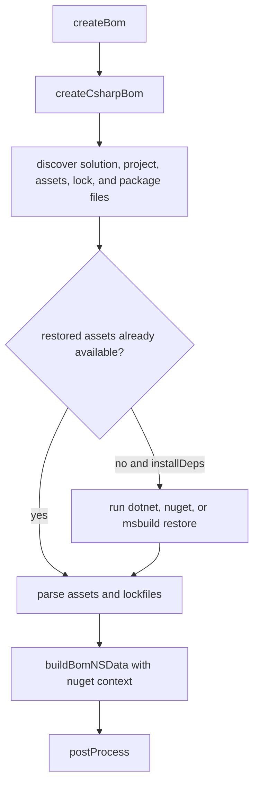

# BOM Pipeline Examples

This page complements [BOM Generation Pipeline](BOM_PIPELINE.md) with concrete walkthroughs based on current implementations in `lib/cli/index.js`.

## Example 1: Java Maven project

### Typical inputs

- `pom.xml`
- optional multi-module structure
- optional Quarkus plugin usage

### Pipeline trace

```text
bin/cdxgen.js
   |
   +--> prepareEnv()
   +--> createBom()
          +--> createXBom() or createMultiXBom()
                 +--> createJavaBom()
                        +--> detect pom.xml / Quarkus
                        +--> run Maven plugin or dependency tree
                        +--> collect package metadata and dependencies
                        +--> buildBomNSData(..., "maven", ...)
   +--> postProcess()
```

### What is specific here

| Stage           | Java-specific behavior                                                                     |
| --------------- | ------------------------------------------------------------------------------------------ |
| detection       | `createXBom()` looks for `pom.xml`, `build.gradle*`, and `build.sbt`-style JVM signals     |
| assembly        | `createJavaBom()` can switch between CycloneDX Maven plugin and dependency-tree collection |
| deep mode       | namespace mapping and class-resolution helpers may run                                     |
| post-processing | standard filtering, formulation, metadata, and annotations still happen exactly once       |

### Common failure shape

Missing JDK or Maven configuration problems show up before or during the generator phase, not during post-processing.

## Example 2: JavaScript project or monorepo

### Typical inputs

- `package.json`
- `package-lock.json`, `yarn.lock`, or `pnpm-lock.yaml`
- source files that can be inspected for Babel import/export analysis

### Mermaid trace



### What is specific here

| Stage            | JavaScript-specific behavior                                                      |
| ---------------- | --------------------------------------------------------------------------------- |
| detection        | `createXBom()` quickly recognizes `package.json`, `rush.json`, and `yarn.lock`    |
| source analysis  | Babel-based import/export analysis can run before manifest assembly               |
| package assembly | lockfiles, bower manifests, and minified JS parsing can all contribute components |
| guarded installs | install-time recovery keeps `--ignore-scripts` enabled                            |

## Example 3: Python project with lockfiles

### Typical inputs

- `pyproject.toml`
- `poetry.lock`, `pdm.lock`, `uv.lock`, or `pylock*.toml`
- sometimes `requirements*.txt`

### Pipeline trace

```text
createBom()
   |
   +--> createPythonBom()
          |
          +--> Pixi shortcut if pixi files exist
          +--> parse pyproject.toml parent component
          +--> parse poetry/pdm/uv/pylock files
          +--> optionally build pip frozen tree or export requirements
          +--> collect dependencies and formulation data
          +--> buildBomNSData(..., "pypi", ...)
   |
   +--> postProcess()
```

### What is specific here

| Stage           | Python-specific behavior                                                                          |
| --------------- | ------------------------------------------------------------------------------------------------- |
| detection       | `createXBom()` checks multiple Python packaging front doors                                       |
| parent metadata | `pyproject.toml` may define the top-level component directly                                      |
| safe fallback   | export-based flows can be used instead of live environment installation                           |
| formulation     | Python can contribute formulation data that is attached before the once-per-BOM post-process step |

## Example 4: .NET project requiring restore

### Typical inputs

- `*.sln`
- `*.csproj`
- `project.assets.json` or `packages.lock.json`
- sometimes `packages.config` or `paket.lock`

### Mermaid trace



### What is specific here

| Stage            | .NET-specific behavior                                                                                  |
| ---------------- | ------------------------------------------------------------------------------------------------------- |
| detection        | `createXBom()` recognizes solution and project files as well as assets and lockfiles                    |
| restore          | `createCsharpBom()` decides between `dotnet`, `nuget`, and `msbuild` restore paths                      |
| diagnostics      | restore failures often include targeted guidance about SDK versions, private feeds, and platform limits |
| package assembly | restored assets and package files both contribute to final dependency shape                             |

## Example 5: Multi-type repository

A polyglot repository is where the shared architecture matters most.

### ASCII trace

```text
createBom()
   |
   +--> createMultiXBom()
          |
          +--> createJavaBom()
          +--> createNodejsBom()
          +--> createPythonBom()
          +--> createCsharpBom()
          +--> merge components[] and dependencies[]
          +--> dedupeBom()
   |
   +--> postProcess() once
```

### Why this example matters

This is why formulation, standards shaping, and final filtering belong in `postProcess()` rather than inside a single `create<Language>Bom()` function.

## Example 6: BOM generation plus adjacent features

The generation pipeline is often followed by additional actions.

| Feature             | What happens after generation                                                                   |
| ------------------- | ----------------------------------------------------------------------------------------------- |
| `--bom-audit`       | evaluates the BOM against direct rule packs and, when applicable, predictive dependency targets |
| `--validate`        | validates the generated BOM before optional export or submission                                |
| SPDX output         | converts the BOM after the CycloneDX path is assembled                                          |
| `submitBom()` usage | uploads the generated document to a downstream system                                           |

These are adjacent to the generation pipeline, but they are still easiest to understand once you know where `createBom()` ends and post-processing begins.

## Related pages

- [BOM Generation Pipeline](BOM_PIPELINE.md)
- [Architecture Implementation Examples](ARCHITECTURE_ECOSYSTEM_EXAMPLES.md)
- [Feature Coverage Map](FEATURE_COVERAGE.md)
