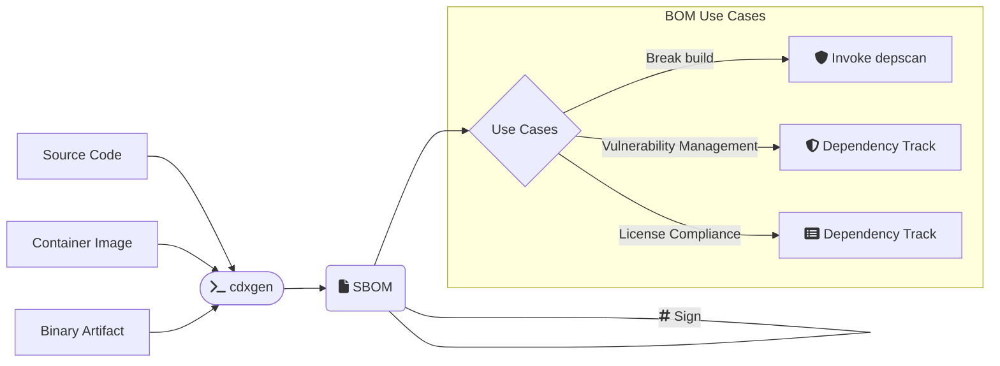

# CLI Usage

## Overview

In CLI mode, you can invoke cdxgen with Source Code, Container Image, or Binary Artifact as input to generate a Software Bill-of-Materials document. This can be subsequently used for a range of use cases as shown.

## Command map

The package ships multiple CLI entry points. Use this table as the top-level navigation map.

| Command        | Purpose                                                                            | Standalone release binary | Dedicated docs                     |
| -------------- | ---------------------------------------------------------------------------------- | ------------------------- | ---------------------------------- |
| `cdxgen`       | Generate CycloneDX and SPDX BOMs from source, images, binaries, git URLs, or purls | yes                       | [CLI Usage](CLI.md)                |
| `cdx-audit`    | Explainable upstream dependency risk prioritization from existing BOMs             | yes                       | [CDX_AUDIT.md](CDX_AUDIT.md)       |
| `cdx-convert`  | Convert CycloneDX JSON to SPDX 3.0.1 JSON-LD                                       | yes                       | [CDX_CONVERT.md](CDX_CONVERT.md)   |
| `cdx-sign`     | Sign a CycloneDX BOM                                                               | yes                       | [CDX_SIGN.md](CDX_SIGN.md)         |
| `cdx-validate` | Validate structure, compliance, and signatures                                     | yes                       | [CDX_VALIDATE.md](CDX_VALIDATE.md) |
| `cdx-verify`   | Verify BOM signatures                                                              | yes                       | [CDX_VERIFY.md](CDX_VERIFY.md)     |
| `evinse`       | Add evidence, call stacks, reachability, and service data                          | no                        | [EVINSE.md](EVINSE.md)             |
| `cdxi`         | Explore BOMs interactively in the REPL                                             | no                        | [REPL.md](REPL.md)                 |

## Aliases and entry-point behavior

Some commands are focused aliases rather than separate implementations.

| Alias                                | Equivalent behavior                                                                                        |
| ------------------------------------ | ---------------------------------------------------------------------------------------------------------- |
| `obom`                               | `cdxgen -t os`                                                                                             |
| `spdxgen`                            | `cdxgen --format spdx`                                                                                     |
| `cbom`                               | `cdxgen` with `includeCrypto`, `evidence`, `deep`, and CycloneDX `1.7` defaults suited for CBOM generation |
| `saasbom`                            | `cdxgen` with `evidence`, `deep`, and CycloneDX `1.7` defaults suited for service-evidence collection      |
| `cdxgen-secure`                      | `cdxgen` with secure mode enabled and dependency installation disabled by default                          |
| `cbom`, `obom`, `saasbom`, `spdxgen` | still accept the regular `cdxgen` flags in addition to their alias behavior                                |

Installing `@cyclonedx/cdxgen` from npm exposes the commands in the command map plus the aliases in this section.

## Dry-run mode

Use `--dry-run` when you want a read-only review of what cdxgen would attempt.

- cdxgen reads local project files only.
- It blocks child-process execution, filesystem writes, temp-dir creation, repository cloning, protobuf export, signing, and remote submission.
- At the end of the run, cdxgen prints an activity summary table that highlights what completed and what was intentionally blocked.
- `--bom-audit` still runs the in-memory formulation audit in dry-run mode, but the predictive dependency audit only plans targets and skips registry metadata fetches, upstream repository cloning, and child SBOM generation.

Example:

```shell
cdxgen --dry-run -t js -p .
```

ASAR example:

```shell
cdxgen --dry-run -t asar -o bom.json /absolute/path/to/app.asar
```

In normal mode, `-t asar` adds archive file inventory, SHA-256 hashes, per-file evidence, JavaScript capability summaries, and embedded Node.js package inventory from manifests shipped inside the archive.

For source-based scans, the primary positional input accepted by `cdxgen` can be:

- a local filesystem path such as `.` or `/path/to/repo`
- a git URL such as `https://github.com/org/repo.git`
- a package URL (purl) such as `pkg:npm/lodash@4.17.21`

When given a git URL, cdxgen clones the repository first. When given a purl, cdxgen resolves the purl to source repository metadata, clones the resolved source, and then performs the normal scan.

Quick cache-catalog examples:

```bash
# Catalogue the local Cargo cache
cdxgen -t cargo-cache -o cargo-cache-bom.json .
```



## Installing

Install the npm package when you want the full multi-command CLI surface:

```shell
sudo npm install -g @cyclonedx/cdxgen
```

You can also invoke any packaged command without a global install:

```shell
corepack pnpm dlx @cyclonedx/cdxgen --help
corepack pnpm dlx --package=@cyclonedx/cdxgen cdx-audit --help
corepack pnpm dlx --package=@cyclonedx/cdxgen cdx-convert --help
corepack pnpm dlx --package=@cyclonedx/cdxgen cdx-validate --help
corepack pnpm dlx --package=@cyclonedx/cdxgen cdx-sign --help
corepack pnpm dlx --package=@cyclonedx/cdxgen cdx-verify --help
corepack pnpm dlx --package=@cyclonedx/cdxgen evinse --help
corepack pnpm dlx --package=@cyclonedx/cdxgen cdxi --help
```

If you are a [Homebrew](https://brew.sh/) user, you can also install [cdxgen](https://formulae.brew.sh/formula/cdxgen) via:

```shell
$ brew install cdxgen
```

Deno install is also supported.

```shell
deno install --allow-read --allow-env --allow-run --allow-sys=uid,systemMemoryInfo,gid,homedir --allow-write --allow-net -n cdxgen "npm:@cyclonedx/cdxgen/cdxgen"
```

You can also use the cdxgen container image

```bash
docker run --rm -v /tmp:/tmp -v $(pwd):/app:rw -t ghcr.io/cyclonedx/cdxgen -r /app -o /app/bom.json
```

### Standalone release binaries

GitHub Releases publish single-file executables for `cdxgen`, `cdxgen-slim`, `cdx-audit`, `cdx-convert`, `cdx-sign`, `cdx-validate`, and `cdx-verify`.

Use the asset name that matches your platform, for example `cdx-audit-linux-amd64`, `cdx-audit-darwin-arm64`, or `cdx-audit-windows-amd64.exe`.

#### Linux

```bash
VERSION="v12.3.1"
ASSET="cdx-audit-linux-amd64"
BASE_URL="https://github.com/cdxgen/cdxgen/releases/download/${VERSION}"

curl -fsSLO "${BASE_URL}/${ASSET}"
curl -fsSLO "${BASE_URL}/${ASSET}.sha256"
sha256sum -c "${ASSET}.sha256"
chmod +x "${ASSET}"
./"${ASSET}" --help
```

#### macOS

```bash
VERSION="v12.3.1"
ASSET="cdx-audit-darwin-arm64"
BASE_URL="https://github.com/cdxgen/cdxgen/releases/download/${VERSION}"

curl -fsSLO "${BASE_URL}/${ASSET}"
curl -fsSLO "${BASE_URL}/${ASSET}.sha256"
shasum -a 256 -c "${ASSET}.sha256"
chmod +x "${ASSET}"
./"${ASSET}" --help
```

#### Windows (PowerShell)

```powershell
$Version = "v12.3.1"
$Asset = "cdx-audit-windows-amd64.exe"
$BaseUrl = "https://github.com/cdxgen/cdxgen/releases/download/$Version"

Invoke-WebRequest -Uri "$BaseUrl/$Asset" -OutFile $Asset
Invoke-WebRequest -Uri "$BaseUrl/$Asset.sha256" -OutFile "$Asset.sha256"
$Expected = (Get-Content "$Asset.sha256" | Select-Object -First 1).Trim().Split()[0]
$Actual = (Get-FileHash $Asset -Algorithm SHA256).Hash.ToLowerInvariant()
if ($Actual -ne $Expected.ToLowerInvariant()) {
  throw "SHA256 mismatch for $Asset"
}
.\$Asset --help
```

#### GitHub Actions with the GitHub CLI

```yaml
permissions:
  contents: read

steps:
  - name: Download cdx-audit standalone binary
    env:
      GH_TOKEN: ${{ github.token }}
    run: |
      gh release download v12.3.1 \
        --repo cdxgen/cdxgen \
        --pattern 'cdx-audit-linux-amd64' \
        --pattern 'cdx-audit-linux-amd64.sha256'
      sha256sum -c cdx-audit-linux-amd64.sha256
      chmod +x cdx-audit-linux-amd64
      ./cdx-audit-linux-amd64 --help
```

To use the deno version, use `ghcr.io/cyclonedx/cdxgen-deno` as the image name.

```bash
docker run --rm -v /tmp:/tmp -v $(pwd):/app:rw -t ghcr.io/cyclonedx/cdxgen-deno -r /app -o /app/bom.json
```

In deno applications, cdxgen could be directly imported without any conversion.

```ts
import { createBom, submitBom } from "npm:@cyclonedx/cdxgen";
```

## Getting Help

```text
cdxgen [command]

Commands:
  cdxgen completion  Generate bash/zsh completion

Options:
  -o, --output                    Output file. Default bom.json                                    [default: "bom.json"]
  -t, --type                      Project type. Please refer to https://cdxgen.github.io/cdxgen/#/PROJECT_TYPES for
                                  supported languages/platforms.                                                 [array]
      --exclude-type              Project types to exclude. Please refer to
                                  https://cdxgen.github.io/cdxgen/#/PROJECT_TYPES for supported languages/platforms.
  -r, --recurse                   Recurse mode suitable for mono-repos. Defaults to true. Pass --no-recurse to disable.
                                                                                               [boolean] [default: true]
  -p, --print                     Print the SBOM as a table with tree.                                         [boolean]
  -c, --resolve-class             Resolve class names for packages. Jar projects only.                          [boolean]
      --deep                      Perform deep searches for components. Useful while scanning C/C++ apps, live OS and
                                  oci images.                                                                  [boolean]
      --git-branch                Git branch to clone when the source is a git URL or purl                      [string]
      --server-url                Dependency track url. Eg: https://deptrack.cyclonedx.io                       [string]
      --skip-dt-tls-check         Skip TLS certificate check when calling Dependency-Track.   [boolean] [default: false]
      --api-key                   Dependency track api key                                                      [string]
      --project-group             Dependency track project group
      --project-name              Dependency track project name. Default use the directory name
      --project-version           Dependency track project version                                [string] [default: ""]
      --project-tag               Dependency track project tag. Multiple values allowed.
      --project-id                Dependency track project id. Either provide the id or the project name and version
                                  together                                                                      [string]
      --parent-project-id         Dependency track parent project id                                            [string]
      --parent-project-name       Dependency track parent project name                                          [string]
      --parent-project-version    Dependency track parent project version                                       [string]
      --required-only             Include only the packages with required scope on the SBOM. Would set
                                  compositions.aggregate to incomplete unless --no-auto-compositions is passed.[boolean]
      --fail-on-error             Fail if any dependency extractor fails.                     [boolean] [default: false]
      --dry-run                   Read-only mode. cdxgen only performs file reads and reports blocked writes,
                                  command execution, temp creation, network access, and submissions.
                                                                                               [boolean] [default: false]
      --no-babel                  Do not use babel to perform usage analysis for JavaScript/TypeScript projects.
                                                                                                               [boolean]
      --generate-key-and-sign     Generate an RSA public/private key pair and then sign the generated SBOM using JSON
                                  Web Signatures.                                                              [boolean]
      --server                    Run cdxgen as a server                                                       [boolean]
      --server-host               Listen address                                         [string] [default: "127.0.0.1"]
      --server-port               Listen port                                                   [number] [default: 9090]
      --install-deps              Install dependencies automatically for some projects. Defaults to true but disabled
                                  for containers and oci scans. Use --no-install-deps to disable this feature.
                                                                                               [boolean] [default: true]
      --validate                  Validate the generated SBOM using json schema. Defaults to true. Pass --no-validate to
                                  disable.                                                     [boolean] [default: true]
      --evidence                  Generate SBOM with evidence for supported languages.        [boolean] [default: false]
      --spec-version              CycloneDX Specification version to use. Defaults to 1.7
                                                                   [number] [choices: 1.4, 1.5, 1.6, 1.7] [default: 1.7]
      --filter                    Filter components containing this word in purl or component.properties.value. Multiple
                                  values allowed.                                                                [array]
      --only                      Include components only containing this word in purl. Useful to generate BOM with
                                  first party components alone. Multiple values allowed.                         [array]
      --author                    The person(s) who created the BOM. Set this value if you're intending the modify the
                                  BOM and claim authorship.                        [array] [default: "OWASP Foundation"]
      --profile                   BOM profile to use for generation. Default generic.
  [choices: "appsec", "research", "operational", "threat-modeling", "license-compliance", "generic", "machine-learning",
                                                       "ml", "deep-learning", "ml-deep", "ml-tiny"] [default: "generic"]
      --include-regex             glob pattern to include. This overrides the default pattern used during
                                  auto-detection.                                                               [string]
      --exclude, --exclude-regex  Additional glob pattern(s) to ignore                                           [array]
      --export-proto              Serialize and export BOM as protobuf binary.                [boolean] [default: false]
      --format                    Export format(s). Supports cyclonedx, spdx, repeated --format flags, or a
                                  comma-separated list such as cyclonedx,spdx.                                   [array]
      --proto-bin-file            Path for the serialized protobuf binary.                          [default: "bom.cdx"]
      --include-formulation       Generate formulation section with git metadata and build tools. Defaults to false.
                                                                                              [boolean] [default: false]
      --include-crypto            Include crypto libraries as components.                     [boolean] [default: false]
      --standard                  The list of standards which may consist of regulations, industry or
                                  organizational-specific standards, maturity models, best practices, or any other
                                  requirements which can be evaluated against or attested to.
       [array] [choices: "asvs-5.0", "asvs-4.0.3", "bsimm-v13", "masvs-2.0.0", "nist_ssdf-1.1", "pcissc-secure-slc-1.1",
                                                                                     "scvs-1.0.0", "ssaf-DRAFT-2023-11"]
      --json-pretty               Pretty-print the generated BOM json.                        [boolean] [default: false]
      --min-confidence            Minimum confidence needed for the identity of a component from 0 - 1, where 1 is 100%
                                  confidence.                                                      [number] [default: 0]
      --technique                 Analysis technique to use
            [array] [choices: "auto", "source-code-analysis", "binary-analysis", "manifest-analysis", "hash-comparison",
                                                                                          "instrumentation", "filename"]
      --auto-compositions         Automatically set compositions when the BOM was filtered. Defaults to true
                                                                                               [boolean] [default: true]
  -h, --help                      Show help                                                                    [boolean]
  -v, --version                   Show version number                                                          [boolean]

Examples:
  cdxgen -t java .                       Generate a Java SBOM for the current directory
  cdxgen -t java -t js .                 Generate a SBOM for Java and JavaScript in the current directory
  cdxgen -t java --profile ml .          Generate a Java SBOM for machine learning purposes.
  cdxgen -t python --profile research .  Generate a Python SBOM for appsec research.
  cdxgen --server                        Run cdxgen as a server

for documentation, visit https://cdxgen.github.io/cdxgen
```

All boolean arguments accept `--no` prefix to toggle the behavior.

## Source input examples

The examples below all use the same positional source argument slot. Replace `.` with a git URL or a supported purl when needed.

### Local path

```shell
cdxgen -t java -o bom.json .
```

You can also scan an explicit absolute path:

```shell
cdxgen -t js -o /tmp/bom.json /Users/me/work/my-app
```

### Git URL

```shell
cdxgen -t java -o bom.json --git-branch main https://github.com/HooliCorp/java-sec-code.git
```

Another example using the default branch:

```shell
cdxgen -t js -o bom.json https://github.com/cdxgen/cdxgen.git
```

### Package URL (purl)

```shell
cdxgen -t js -o bom.json "pkg:npm/lodash@4.17.21"
```

For other ecosystems, pass the purl directly as the source input:

```shell
cdxgen -t python -o bom.json "pkg:pypi/requests@2.32.3"
cdxgen -t java -o bom.json "pkg:maven/org.apache.logging.log4j/log4j-core@2.24.3"
```

For purl inputs, cdxgen resolves registry metadata to locate a repository URL, clones the source to a temporary directory, and runs the normal SBOM + post-processing pipeline.

Supported purl source types:

- `npm`, `pypi`, `gem`, `cargo`, `pub`, `maven` (version required), `composer` (registry metadata lookup)
- `github`, `bitbucket` (direct repository mapping)
- `generic` (requires `vcs_url` or `download_url` qualifier)

> **Security note:** Registry metadata can be inaccurate or malicious. Validate the resolved repository URL before relying on the SBOM.

## Export formats

CycloneDX remains the default export format.

Use `--format spdx` to emit an SPDX 3.0.1 JSON-LD document:

```shell
cdxgen -t nodejs --format spdx -o bom.spdx.json .
```

Use `--format cyclonedx,spdx` to emit both formats in one run. The `--output`
path is used for the CycloneDX file and cdxgen writes a sibling `*.spdx.json`
file for the SPDX export:

```shell
cdxgen -t nodejs --format cyclonedx,spdx -o bom.cdx.json .
```

You can also repeat `--format` to request both outputs:

```shell
cdxgen -t nodejs --format cyclonedx --format spdx -o bom.cdx.json .
```

If the output file already ends with `.spdx.json`, cdxgen automatically selects
the SPDX export format:

```shell
cdxgen -t nodejs -o bom.spdx.json .
```

When `--validate` is enabled, cdxgen validates the generated SPDX 3.0.1 export
after converting the final CycloneDX BOM.

## Converting an existing BOM

Use the dedicated `cdx-convert` command to convert an existing CycloneDX JSON
file into SPDX JSON-LD:

```shell
cdx-convert -i bom.json -o bom.spdx.json
```

`cdx-convert` supports CycloneDX 1.6 and 1.7 inputs and exports SPDX 3.0.1.

Refer to [cdx-convert — CycloneDX to SPDX](CDX_CONVERT.md) for complete usage.
