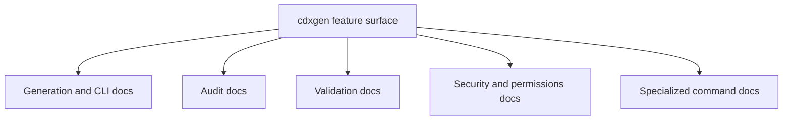

# Feature Coverage Map

This page answers a simple question: where is each major cdxgen capability already documented?

It is especially useful when you are looking for dry-run behavior, BOM audit, predictive audit, validation, or other command-specific workflows without searching the whole docs tree.

## Coverage at a glance

### Mermaid map



### Primary coverage table

| Feature                      | Coverage status | Primary docs                                                         | Notes                                                                                                         |
| ---------------------------- | --------------- | -------------------------------------------------------------------- | ------------------------------------------------------------------------------------------------------------- |
| dry-run mode                 | covered         | `CLI.md`, `BOM_AUDIT.md`, `HBOM.md`                                  | includes general dry-run behavior and HBOM-specific differences                                               |
| direct BOM audit             | covered         | `BOM_AUDIT.md`                                                       | focuses on post-generation rule evaluation against the current BOM                                            |
| predictive dependency audit  | covered         | `CDX_AUDIT.md`, `BOM_AUDIT.md`                                       | `cdx-audit` is the dedicated command; `--bom-audit` can trigger predictive target selection during generation |
| validation                   | covered         | `CDX_VALIDATE.md`, `CLI.md`                                          | includes standalone validation command and `cdxgen --validate` behavior                                       |
| signing                      | covered         | `CDX_SIGN.md`                                                        | covers JSF signing workflows                                                                                  |
| signature verification       | covered         | `CDX_VERIFY.md`                                                      | covers signature verification behavior                                                                        |
| CycloneDX to SPDX conversion | covered         | `CDX_CONVERT.md`                                                     | covers standalone conversion command                                                                          |
| server mode                  | covered         | `SERVER.md`                                                          | API-oriented generation flow                                                                                  |
| REPL / interactive use       | covered         | `REPL.md`                                                            | interactive exploration and server-adjacent workflows                                                         |
| evidence enrichment          | covered         | `EVINSE.md`                                                          | evidence, reachability, service, and call-stack enrichment                                                    |
| hardware BOM                 | covered         | `HBOM.md`, `LESSON13.md`                                             | includes dry-run and validation notes                                                                         |
| permissions and secure mode  | covered         | `PERMISSIONS.md`, `ALLOWED_HOSTS_AND_COMMANDS.md`, `THREAT_MODEL.md` | describes allowlists, secure mode, and threat boundaries                                                      |
| supported project types      | covered         | `PROJECT_TYPES.md`                                                   | canonical project type reference                                                                              |
| environment variables        | covered         | `ENV.md`                                                             | runtime knobs and configuration                                                                               |

## Feature-specific pointers

### Dry-run mode

Use these docs together:

| Doc                             | What it adds                                                    |
| ------------------------------- | --------------------------------------------------------------- |
| `CLI.md`                        | the user-facing behavior of `--dry-run` for normal cdxgen usage |
| `BOM_AUDIT.md`                  | how BOM audit behaves differently in dry-run mode               |
| `HBOM.md`                       | HBOM-specific dry-run semantics and partial-output behavior     |
| `ALLOWED_HOSTS_AND_COMMANDS.md` | how allowlist review interacts with dry-run workflows           |

### BOM audit vs predictive audit

These are related but not identical.

```text
generated BOM
   |
   +--> direct BOM audit      -> rules evaluated against the current BOM
   |
   +--> predictive audit      -> upstream targets selected for deeper inspection
```

| Capability                                  | Best doc       |
| ------------------------------------------- | -------------- |
| direct rule evaluation after generation     | `BOM_AUDIT.md` |
| dedicated upstream dependency risk analysis | `CDX_AUDIT.md` |
| dry-run interaction with audit behavior     | `BOM_AUDIT.md` |

### Validation

| Doc                  | What it covers                                                           |
| -------------------- | ------------------------------------------------------------------------ |
| `CDX_VALIDATE.md`    | standalone `cdx-validate` command, benchmarks, reporters, and exit codes |
| `CLI.md`             | how validation fits into the main CLI experience                         |
| `TROUBLESHOOTING.md` | how to debug validation failures in generated BOMs                       |

## Suggested reading by goal

| Goal                              | Start here        | Then read                                          |
| --------------------------------- | ----------------- | -------------------------------------------------- |
| understand how generation works   | `BOM_PIPELINE.md` | `BOM_PIPELINE_EXAMPLES.md`                         |
| understand how code is organized  | `ARCHITECTURE.md` | `ARCHITECTURE_ECOSYSTEM_EXAMPLES.md`               |
| audit a generated BOM             | `BOM_AUDIT.md`    | `CDX_AUDIT.md`                                     |
| validate compliance and structure | `CDX_VALIDATE.md` | `TROUBLESHOOTING.md`                               |
| work safely in secure mode        | `PERMISSIONS.md`  | `ALLOWED_HOSTS_AND_COMMANDS.md`, `THREAT_MODEL.md` |

## Purpose of this document

The documentation already covers the features you called out. The problem was discoverability, not total absence. This file is meant to make that coverage visible and navigable.

## Related pages

- [Architecture Overview](ARCHITECTURE.md)
- [BOM Generation Pipeline](BOM_PIPELINE.md)
- [CLI Usage](CLI.md)
- [BOM Audit](BOM_AUDIT.md)
- [cdx-audit — Predictive supply-chain audit](CDX_AUDIT.md)
- [cdx-validate — Supply-Chain Compliance Validator](CDX_VALIDATE.md)
