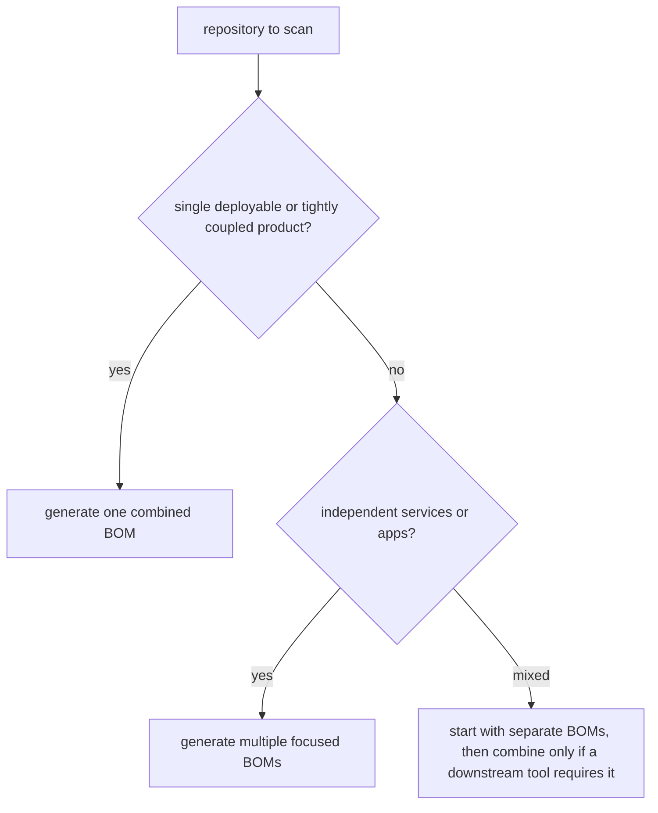
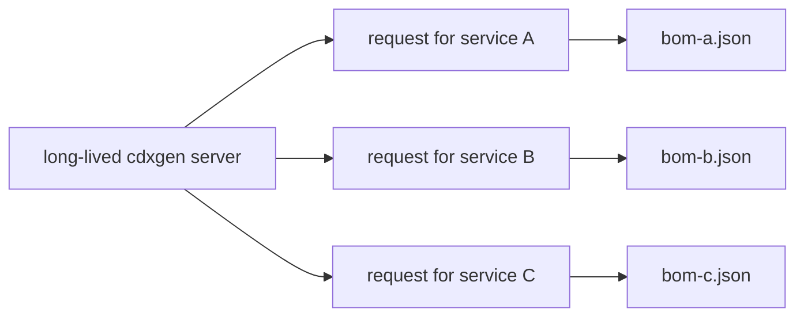

# Scanning Large and Complex Projects

This guide is for teams scanning monorepos, large polyglot applications, or repositories with a mix of build roots, generated content, and infrastructure folders. The aim is to help you choose a scan shape that is accurate, fast enough, and maintainable in CI.

## The core decision

The first question is not which flag to use. It is whether you want one combined BOM or several smaller BOMs.

A useful downstream-tooling reminder: OWASP dep-scan v6+ supports multiple BOM inputs via `--bom-dir`, so choosing several focused BOMs does not automatically block later audit workflows.

### ASCII decision tree

```text
large repository
   |
   +--> one deliverable and one deployment unit?
   |        |
   |        +--> yes -> combined BOM may be appropriate
   |
   +--> many services, tools, or deployables?
            |
            +--> yes -> prefer one BOM per service or language
```

### Mermaid decision tree



## Strategy 1: scan the whole repository once

This works best when the repository is a true product root and the subdirectories all contribute to one shipped artifact.

```bash
cdxgen -t java -t js -t py -o bom.json .
```

### When this approach works well

| Signal | Why it is a good fit |
|---|---|
| one release process | the combined graph mirrors how the software ships |
| shared root manifests | discovery from the repository root is natural |
| downstream tooling expects one BOM | simplifies later processing |

## Strategy 2: scan per service or per language

This is usually the better fit for a platform monorepo with separate applications.

```bash
cdxgen -t java -o bom-service-a.json services/service-a
cdxgen -t js -o bom-service-b.json services/service-b
cdxgen -t py -o bom-service-c.json services/service-c
```

### Why this often scales better

| Benefit | Why it matters |
|---|---|
| smaller output files | easier to inspect and validate |
| clearer ownership | teams can own their own BOMs |
| faster reruns | one changed service does not force a full repository rescan |

## Strategy 3: use include and exclude patterns to shape discovery

When you do want a repository-root scan, discovery controls are the main way to keep it focused.

### Discovery controls

| Option | Best use |
|---|---|
| `--include-regex` | limit scanning to a subset of manifests |
| `--exclude` | remove folders such as fixtures, examples, vendored code, or generated artifacts |
| `--exclude-type` | skip an ecosystem you do not want represented |

### Example

```bash
cdxgen \
  -t java -t js \
  --include-regex "**/services/*/{pom.xml,package.json}" \
  --exclude "**/test/**" \
  --exclude "**/fixtures/**" \
  -o bom.json .
```

## Strategy 4: reduce work for repeated CI scans

If the same repositories are scanned often, the best optimisation is often not a new flag. It is changing where and how the scan runs.

| Approach | Why it helps |
|---|---|
| scan only changed services | avoids full monorepo work |
| keep cache directories persistent | helps Trivy and package managers |
| commit lockfiles consistently | reduces install-time guesswork |
| use server mode for batches | avoids repeated Node.js startup cost |

## Understanding recursion

By default, cdxgen walks the directory tree and finds manifests below the provided path. That is the right default for most monorepos.

If you want only the root build file, narrow the input path or disable recursion with the relevant flag for your workflow.

### Repository shapes

```text
repo/
  pom.xml                    root-only scan targets this
  services/
    api/pom.xml              recursive scan finds this
    web/package.json         recursive scan finds this
    jobs/pyproject.toml      recursive scan finds this
```

A useful rule is this. If the repository root is more of an umbrella than a product, lean toward explicit subdirectory scans.

## Performance tuning that matters in practice

### 1. Avoid unnecessary installs

If dependencies are already present, use `--no-install-deps`.

```bash
cdxgen -t js --no-install-deps -o bom.json .
```

### 2. Cut enrichment overhead when you do not need it

```bash
FETCH_LICENSE=false cdxgen -t java -o bom.json .
CDXGEN_TIMEOUT_MS=5000 cdxgen -t java -o bom.json .
```

### 3. Limit output to direct dependencies when appropriate

```bash
cdxgen -t java --required-only -o bom.json .
```

### 4. Decompose the problem before turning on deep analysis

If a repository is huge, do not start with `--deep`. First establish that a manifest-level scan is producing the expected components. Then enable deeper modes only for the services that need them.

## Server mode for scan farms and batch workflows

When many projects are scanned in the same environment, server mode can reduce per-run overhead.

```bash
cdxgen --server --server-port 9090
curl -s "http://localhost:9090/sbom?path=/workspace/service-a&type=java" -o bom-a.json
curl -s "http://localhost:9090/sbom?path=/workspace/service-b&type=js" -o bom-b.json
```

### Mermaid batch view



## Maven and Gradle caches as separate inventory targets

Large Java organisations sometimes want two different answers:

1. what this specific repo uses
2. what the shared build cache contains

Those are different scans. If you care about the cache itself, scan it directly.

```bash
cdxgen -t maven-cache -o bom-cache.json ~/.m2
```

## A practical playbook for large monorepos

Use this sequence if you want a calm rollout.

1. start with one service and one ecosystem
2. confirm the expected manifests are discovered
3. confirm the dependency tree is acceptable
4. decide whether one combined BOM is still useful
5. only then widen the scan to more services or types

## Common mistakes

| Mistake | Better alternative |
|---|---|
| scanning the whole monorepo first in deep mode | start with a manifest-focused slice |
| relying on broad excludes only | combine include and exclude controls |
| merging unrelated deployables into one BOM by default | split by service first |
| treating infrastructure folders as product dependencies automatically | exclude or scan them separately with intent |

## Related pages

- [BOM Generation Pipeline](BOM_PIPELINE.md)
- [Troubleshooting Common Issues](TROUBLESHOOTING.md)
- [Server Usage](SERVER.md)
