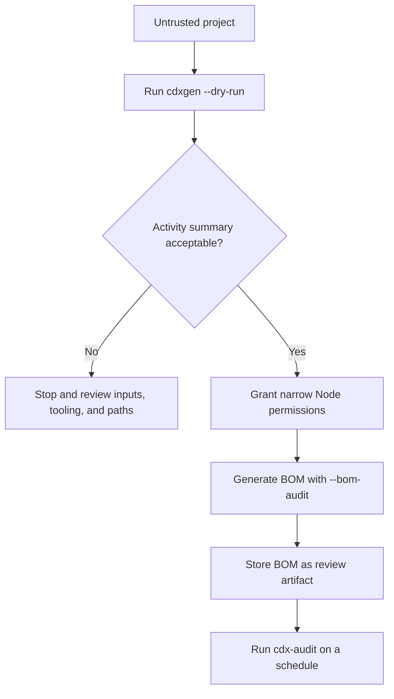
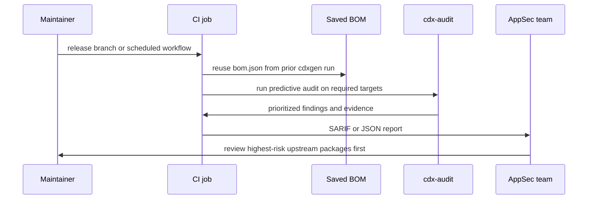

# Supply-chain transparency with cdxgen

Supply-chain transparency helps teams understand what they build, ship, and trust. When the input project is untrusted, the goal is to collect that visibility without giving the scan more access than it needs.

cdxgen supports that staged approach. Start with `--dry-run` to inspect an untrusted project without side effects. Move to the Node.js permissions model only when you are ready to produce a persisted BOM. Add `--bom-audit` to review your own workflows and build surfaces. Use `cdx-audit` on a schedule to re-check dependency risk as upstream projects change over time.

This guide is written for four common personas:

- application developers who need a BOM before a release
- AppSec and supply-chain analysts who need evidence with low operational risk
- build and platform engineers who need to harden runners, containers, and CI pipelines
- governance teams who need a repeatable review loop instead of one-time exports

## Safety first, then accuracy

There is no single flag that makes a malicious project safe to inspect. The safest path is a staged workflow:

1. inspect the project in read-only dry-run mode
2. review the activity summary and decide what cdxgen would need next
3. grant the smallest possible filesystem and process permissions
4. generate the BOM and audit findings in a disposable workspace
5. re-run periodic predictive audits from saved BOMs instead of repeatedly touching the original project

That sequence keeps risk low while still letting you grow toward more complete coverage when you trust the environment and understand the requested access.



## A low-risk workspace layout

Keep the project, the generated BOM, and any audit cache separated. A simple layout like this makes permission scoping easier:

```text
/srv/cdxgen-review/
├── input/
│   └── untrusted-project/
│       ├── package.json
│       ├── pnpm-lock.yaml
│       ├── Dockerfile
│       └── .github/
│           └── workflows/
│               └── release.yml
├── output/
│   ├── bom.json
│   └── audit.sarif
└── cache/
    └── cdx-audit/
```

In this layout, `input/` is read-only from the scanner's point of view, `output/` is the only write target, and `cache/` is reserved for periodic predictive audits that reuse upstream clones and child SBOMs.

## Step 1: inspect untrusted projects with dry-run mode

Dry-run mode is the best first pass for untrusted source trees, archives, and host-style collections. cdxgen reads local files, plans work, and blocks side effects such as temp directory creation, child-process execution, repository cloning, signing, and remote submission.

```bash
cd /srv/cdxgen-review
cdxgen --dry-run -t js -p /srv/cdxgen-review/input/untrusted-project
```

If you also want an immediate view of workflow and dependency-source issues, combine dry-run with BOM audit:

```bash
cdxgen \
  --dry-run \
  --bom-audit \
  --bom-audit-categories ci-permission,dependency-source,package-integrity \
  -t js \
  /srv/cdxgen-review/input/untrusted-project
```

This gives you two useful outputs in one pass:

- an activity summary that shows what cdxgen read and what it intentionally blocked
- in-memory BOM audit findings for rules that still work in dry-run mode, especially formulation and CI-oriented rules

Dry-run is the right default for:

- third-party repositories you just received
- pull request branches you do not want to build yet
- suspicious archives such as Electron ASAR packages
- initial review of a build runner or host where you want to understand the collector surface first

It is not the final word on accuracy. Some ecosystems need child processes, temporary extraction, or upstream lookups for richer coverage. The value of dry-run is that it tells you exactly where the scan would need more trust.

## Step 2: move to the permissions model only when needed

Once the dry-run output looks reasonable, switch to the Node.js permissions model and allow only the paths and capabilities that match your reviewed workflow. cdxgen secure mode helps you think in those boundaries, and the `ghcr.io/cyclonedx/cdxgen-secure` image already starts from that posture.

```bash
export CDXGEN_SECURE_MODE=true
export CDXGEN_TEMP_DIR=/srv/cdxgen-review/tmp
mkdir -p /srv/cdxgen-review/output "$CDXGEN_TEMP_DIR"
export NODE_OPTIONS="--permission \
  --allow-fs-read=/srv/cdxgen-review/input/* \
  --allow-fs-write=/srv/cdxgen-review/output \
  --allow-fs-write=/srv/cdxgen-review/output/bom.json \
  --allow-fs-write=/srv/cdxgen-review/tmp \
  --allow-fs-write=/srv/cdxgen-review/tmp/*"

cdxgen \
  -t js \
  --bom-audit \
  -o /srv/cdxgen-review/output/bom.json \
  /srv/cdxgen-review/input/untrusted-project
```

Only add `--allow-child-process` when the reviewed dry-run shows that cdxgen must invoke external tools. When that is necessary, populate `CDXGEN_ALLOWED_COMMANDS` from the dry-run output before widening process access.

```bash
export CDXGEN_ALLOWED_COMMANDS="node,npm"
export NODE_OPTIONS="$NODE_OPTIONS --allow-child-process"
```

If cdxgen reports a denied path, add only that specific path after review rather than widening access immediately.

For teams that prefer container isolation, use the secure image with a tightly mounted workspace:

```bash
docker run --rm \
  -v /srv/cdxgen-review/input/untrusted-project:/app:ro \
  -v /srv/cdxgen-review/output:/out:rw \
  -v /srv/cdxgen-review/tmp:/tmp/cdxgen:rw \
  -e CDXGEN_TEMP_DIR=/tmp/cdxgen \
  ghcr.io/cyclonedx/cdxgen-secure \
  cdxgen -t js --bom-audit -o /out/bom.json /app
```

The intent is simple. Dry-run answers, "what would this scan try to do?" Secure mode answers, "which of those actions am I willing to allow?"

## What the safe handoff looks like in automation

The following GitHub Actions pattern keeps permissions explicit and stores the generated BOM as a build artifact. It is relevant to platform teams, maintainers, and compliance teams that need a review trail.

Install cdxgen in the job from npm, or download a verified standalone binary before you run it:

```bash
npm install -g @cyclonedx/cdxgen
cdxgen --version
```

```bash
VERSION="v12.4.0"
OS=linux
ARCH=amd64
BINARY_NAME="cdxgen-${OS}-${ARCH}"
BASE_URL="https://github.com/cdxgen/cdxgen/releases/download/${VERSION}"

curl -fsSLO "${BASE_URL}/${BINARY_NAME}"
curl -fsSLO "${BASE_URL}/${BINARY_NAME}.sha256"
sha256sum -c "${BINARY_NAME}.sha256"
chmod +x "${BINARY_NAME}"
./"${BINARY_NAME}" --version
```

```yaml
permissions:
  contents: read

jobs:
  sbom:
    runs-on: ubuntu-latest
    steps:
      - uses: actions/checkout@v4
      - name: Generate BOM with explicit Node permissions
        env:
          CDXGEN_SECURE_MODE: "true"
          CDXGEN_TEMP_DIR: "${{ runner.temp }}/cdxgen"
          NODE_OPTIONS: >-
            --permission
            --allow-fs-read=${{ github.workspace }}/*
            --allow-fs-write=${{ runner.temp }}/cdxgen
            --allow-fs-write=${{ runner.temp }}/cdxgen/*
            --allow-fs-write=${{ github.workspace }}/artifacts
            --allow-fs-write=${{ github.workspace }}/artifacts/bom.json
        run: |
          mkdir -p "${CDXGEN_TEMP_DIR}"
          mkdir -p "${GITHUB_WORKSPACE}/artifacts"
          cdxgen \
            -t js \
            --bom-audit \
            --bom-audit-categories ci-permission,dependency-source \
            -o "${GITHUB_WORKSPACE}/artifacts/bom.json" \
            "${GITHUB_WORKSPACE}"
```

If the reviewed dry-run shows that the workflow must execute external tools, extend `NODE_OPTIONS` with `--allow-child-process` and set `CDXGEN_ALLOWED_COMMANDS` to the reviewed command list.

This pattern is useful because the workflow permissions, filesystem access, temp directory, and audit scope are all visible in one place.

## Step 3: use BOM audit to harden your own build environment

`--bom-audit` is not only for third-party packages. It also helps you review your own automation and build estate.

For source repositories, the `ci-permission` category highlights risky workflow patterns such as mutable GitHub Actions references, risky triggers, and overly broad token use:

```bash
cdxgen \
  -t js \
  --bom-audit \
  --bom-audit-categories ci-permission,dependency-source \
  -o /srv/cdxgen-review/output/bom.json \
  /srv/cdxgen-review/input/untrusted-project
```

For build containers or hardened runner images, generate a rootfs BOM and audit the filesystem posture instead of relying only on package manifests:

```bash
cdxgen \
  /srv/runner-rootfs \
  -t rootfs \
  --bom-audit \
  --bom-audit-categories rootfs-hardening,container-risk \
  -o /srv/cdxgen-review/output/runner-rootfs-bom.json
```

For a live build host, combine HBOM and runtime inventory when you want a clearer view of what the machine is actually exposing:

```bash
hbom \
  --include-runtime \
  --bom-audit \
  --bom-audit-categories host \
  -o /srv/cdxgen-review/output/host-view.json
```

These three views answer different hardening questions:

| Surface                         | Useful audit focus                   | Typical question                                                |
| ------------------------------- | ------------------------------------ | --------------------------------------------------------------- |
| repository workflows            | `ci-permission`, `dependency-source` | Are our pipelines granting more power than the job needs?       |
| runner image or root filesystem | `rootfs-hardening`, `container-risk` | Is the build environment drifting away from our baseline?       |
| live host                       | `host`                               | Does the machine posture still match what we think we deployed? |

## A simple developer-facing policy snippet

Some teams like to keep the scanning policy next to their pipeline code. A small wrapper makes the workflow easier to explain and review:

```bash
#!/usr/bin/env bash
set -euo pipefail

export CDXGEN_SECURE_MODE=true
export CDXGEN_TEMP_DIR=/workspace/tmp/cdxgen
mkdir -p /workspace/artifacts "$CDXGEN_TEMP_DIR"
export NODE_OPTIONS="--permission --allow-fs-read=/workspace/* --allow-fs-write=/workspace/artifacts --allow-fs-write=/workspace/artifacts/bom.json --allow-fs-write=/workspace/tmp/cdxgen --allow-fs-write=/workspace/tmp/cdxgen/*"

# If dry-run shows external tools are required:
# export CDXGEN_ALLOWED_COMMANDS="node,npm"
# export NODE_OPTIONS="$NODE_OPTIONS --allow-child-process"

cdxgen \
  -t js \
  --bom-audit \
  --bom-audit-categories ci-permission,dependency-source,package-integrity \
  -o /workspace/artifacts/bom.json \
  /workspace/source
```

That is a small example, but it matters for maintainers. They can review one file and understand the scan boundary, the output location, and the audit intent without reading a long policy document first.

## Step 4: use predictive audit as a periodic review loop

`cdx-audit` is the periodic part of the story. Instead of rescanning the original untrusted repository every time, you can keep the generated BOM and re-evaluate dependency risk later. This is helpful because upstream packages, release workflows, and provenance signals change even when your code does not.

Start with a saved BOM:

```bash
cdx-audit \
  --bom /srv/cdxgen-review/output/bom.json \
  --workspace-dir /srv/cdxgen-review/cache/cdx-audit \
  --reports-dir /srv/cdxgen-review/output \
  --scope required \
  --max-targets 25
```

For a machine-readable report that fits code-scanning style pipelines:

```bash
cdx-audit \
  --bom /srv/cdxgen-review/output/bom.json \
  --report sarif \
  --report-file /srv/cdxgen-review/output/audit.sarif \
  --workspace-dir /srv/cdxgen-review/cache/cdx-audit
```

This predictive audit is a good fit for:

- nightly or weekly scheduled jobs
- release-candidate reviews
- supplier intake checkpoints
- portfolio triage across many existing BOMs

It is especially helpful for AppSec teams because it creates a prioritized review queue instead of a flat list of all dependencies.



## Choosing the right cadence by persona

Developers usually want a fast answer before merge or release. For them, dry-run plus a narrow `--bom-audit` category set is often enough to catch obvious workflow and dependency-source issues early.

Platform and build engineers care more about drift. They benefit from routine rootfs, HBOM, and CI workflow audits because those surfaces change independently of the application code they support.

AppSec teams usually need the richest signal. They will get the best results from a two-stage pattern: generate the BOM once in a controlled environment, then let `cdx-audit` revisit that BOM on a schedule with a reusable cache and a bounded target count.

Governance and compliance teams care about repeatability. Saved BOMs, saved SARIF reports, and visible permission boundaries make the review trail easier to explain during supplier reviews, internal audits, and incident follow-up.

## Recommended operating pattern

If you need one operating pattern to start with, use this one:

1. run `cdxgen --dry-run` on the untrusted project
2. review the blocked operations and the dry-run BOM audit findings
3. re-run with secure mode and the smallest reviewed permission set
4. store the BOM as an artifact
5. schedule `cdx-audit` against the saved BOM every week or before each release
6. use BOM audit categories for your own workflows, runner images, and host posture, not only for third-party dependency review

That workflow does not promise perfect safety, and it does not claim perfect completeness. What it does provide is a balanced way to increase transparency without casually widening trust.

## Related documentation

- [Permissions](PERMISSIONS.md)
- [CLI Usage](CLI.md)
- [BOM Audit](BOM_AUDIT.md)
- [cdx-audit](CDX_AUDIT.md)
- [Threat Model](THREAT_MODEL.md)
