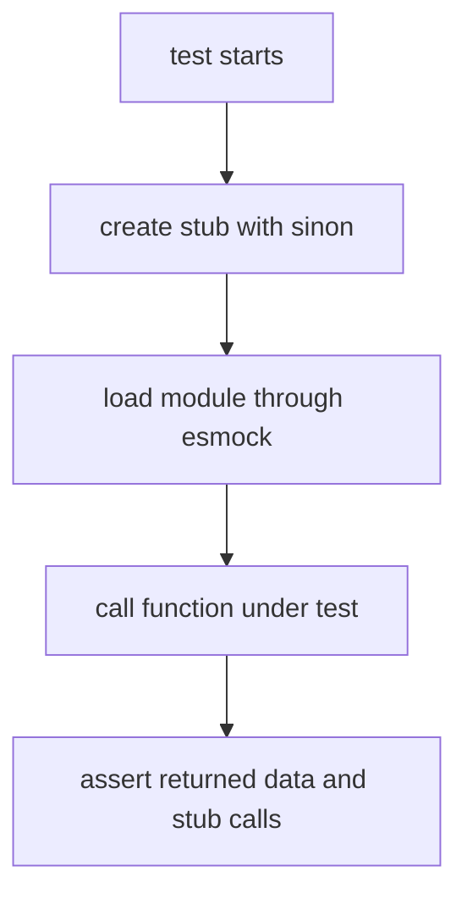

# Testing Guide

cdxgen uses poku for unit and integration tests, with test files co-located next to the modules they cover. This page explains the conventions that make tests fit naturally into the repository and stay stable across Linux, macOS, and Windows.

## The testing model in one picture

### ASCII layout

```text
source file                         nearby test file
-----------                         ----------------
lib/helpers/utils.js       <---->   lib/helpers/utils.poku.js
lib/cli/index.js           <---->   lib/cli/index.poku.js
lib/server/server.js       <---->   lib/server/server.poku.js
```

### Mermaid flow


## What poku is configured to run

`.pokurc.jsonc` tells poku to scan `lib/` and run files ending in `.poku.js`.

That means new tests should normally live next to the source module they exercise, not under a central `tests/unit/` tree.

## Running tests

| Goal                       | Command                          |
| -------------------------- | -------------------------------- |
| run the full suite         | `pnpm test`                      |
| run in watch mode          | `pnpm run watch`                 |
| run a single file directly | `node lib/helpers/utils.poku.js` |

## The three most common test shapes

| Test shape                 | Best for                                                         |
| -------------------------- | ---------------------------------------------------------------- |
| pure parser test           | lockfile and manifest parsing with no external process execution |
| mocked integration test    | generator paths that shell out or call network helpers           |
| behavior-focused unit test | utility modules, formatters, validators, and small helpers       |

## Basic anatomy of a poku test

```js
import { assert, describe, it } from "poku";

import { myFunction } from "./my-module.js";

describe("myFunction()", () => {
  it("returns the expected value", () => {
    const result = myFunction("input");
    assert.strictEqual(result, "expected");
  });
});
```

Poku re-exports Node's assert helpers, so the usual methods such as `strictEqual`, `deepStrictEqual`, `ok`, and `throws` are available.

Poku also supports lifecycle hooks such as `beforeEach` and `afterEach`, which you can see in existing files like `lib/server/server.poku.js`.

## Fixture strategy

Fixtures live under `test/`. They should be realistic enough to catch regressions and small enough to read during review.

### Fixture selection guide

| Use this kind of fixture | When you want to validate                     |
| ------------------------ | --------------------------------------------- |
| happy-path real file     | the normal parser path                        |
| small crafted edge case  | unusual syntax, aliases, or optional sections |
| missing-file case        | graceful empty-array or soft-failure behavior |

### ASCII fixture flow

```text
fixture file in test/
      |
      v
parser helper or generator
      |
      v
assertions on package count, names, versions, purls, refs, and graph shape
```

## Path handling in fixtures

Tests run on multiple operating systems. Avoid hardcoded separators. Build paths with `node:path` helpers or `import.meta.url`.

```js
import path from "node:path";
import { fileURLToPath } from "node:url";

const __dirname = path.dirname(fileURLToPath(import.meta.url));
const fixture = path.join(__dirname, "../../test/my-fixture.lock");
```

## Parser tests

Parser tests should be the first thing you add when introducing a new format. They are fast, deterministic, and tell reviewers whether the raw data model is correct before any orchestration logic gets involved.

A good parser test usually checks:

1. package count
2. a few representative package names and versions
3. purl or `bom-ref` correctness where present
4. the missing-file case

## Mocked generator tests with `esmock`

Because cdxgen is pure ESM, use `esmock` to replace imported dependencies during a test. This is the standard way to stub `safeSpawnSync`, metadata fetchers, or helper functions that would otherwise make the test slow or environment-dependent.

```js
import esmock from "esmock";
import sinon from "sinon";
import { assert, describe, it } from "poku";

describe("createJavaBom()", () => {
  it("handles a failed spawn gracefully", async () => {
    const spawnStub = sinon
      .stub()
      .returns({ stdout: "", stderr: "error", status: 1 });

    const { createJavaBom } = await esmock("../cli/index.js", {
      "../helpers/utils.js": {
        safeSpawnSync: spawnStub,
      },
    });

    const result = await createJavaBom("/tmp/project", {});
    assert.ok(result);
  });
});
```

### Mermaid mocking flow



## Using `sinon`

`sinon` is the standard companion library for stubs, spies, and restores.

| Tool              | Use it when                                           |
| ----------------- | ----------------------------------------------------- |
| `sinon.stub()`    | you want to replace behavior completely               |
| `sinon.spy()`     | you want to observe calls to a real function          |
| `sinon.restore()` | you want to clean up all stubs and spies after a test |

If several tests in a block create stubs, restore them in `afterEach()`.

## What to assert in BOM-oriented tests

When a test exercises a generator rather than a raw parser, prefer asserting on stable outcomes rather than fragile full-object snapshots.

| Stable assertion                  | Why it ages well                          |
| --------------------------------- | ----------------------------------------- |
| `components.length`               | robust against unrelated metadata churn   |
| specific component names or purls | proves the core parse worked              |
| specific dependency edges         | proves graph construction worked          |
| presence of `parentComponent`     | proves top-level identity handling worked |

Avoid asserting on fields that are likely to change for unrelated reasons unless the test is specifically about those fields.

## Cross-platform guidance

cdxgen CI runs tests on Linux, macOS, and Windows. Keep that in mind when assertions involve:

| Concern               | Better pattern                                           |
| --------------------- | -------------------------------------------------------- |
| file paths            | `path.join`, `path.normalize`, separator-agnostic checks |
| executable names      | assert on the program name, not the absolute path        |
| temporary directories | avoid `/tmp` assumptions in expected values              |
| line endings          | compare normalised strings when necessary                |

## A good testing order for feature work

If you are adding a feature, this order keeps the feedback loop fast.

1. add a parser fixture and parser test
2. add orchestration code
3. add a mocked generator test
4. only then consider larger integration coverage

## Common mistakes

| Mistake                                        | Better approach                             |
| ---------------------------------------------- | ------------------------------------------- |
| running the real package manager in unit tests | stub `safeSpawnSync`                        |
| using deeply brittle whole-object assertions   | assert on the meaningful subset             |
| forgetting cleanup                             | call `sinon.restore()` or use `afterEach()` |
| hardcoding POSIX paths                         | use `node:path` helpers                     |

## Related pages

- [Adding Support for a New Language or Ecosystem](ADD_ECOSYSTEM.md)
- [Architecture Overview](ARCHITECTURE.md)
