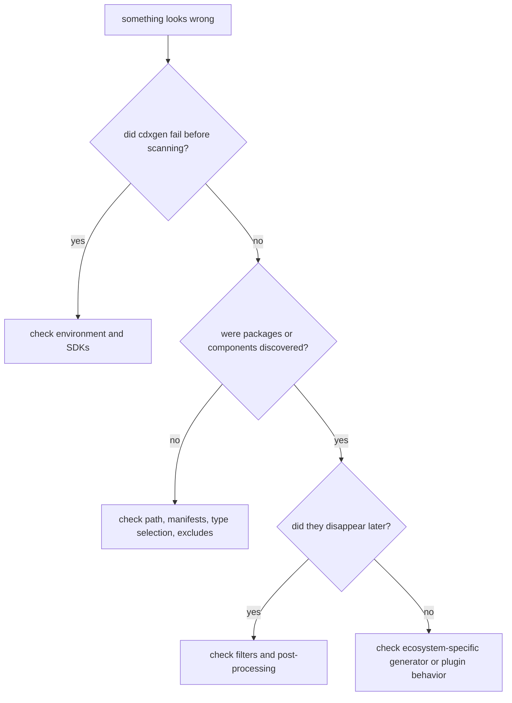

# Troubleshooting Common Issues

This page groups common cdxgen problems by symptom so you can move from what you see to what to inspect next. The structure follows the real pipeline: environment, discovery, generation, post-processing, and output.

## Start here first

If you are not sure where the problem begins, do these two things:

1. rerun with `CDXGEN_DEBUG_MODE=debug`
2. note whether the problem happens before package discovery, during package-manager execution, or only in the final BOM

### ASCII triage map

```text
problem observed
   |
   +--> tool or SDK missing? --------> environment issue
   |
   +--> no manifests or no packages? -> discovery or generator issue
   |
   +--> packages found but final JSON looks wrong?
   |                                 -> post-processing issue
   |
   +--> image or host inventory incomplete?
                                     -> plugin, permission, or container-export issue
```

### Mermaid triage flow



## Diagnostic commands worth memorising

| Goal                             | Command                                                    |
| -------------------------------- | ---------------------------------------------------------- |
| show generator decisions         | `CDXGEN_DEBUG_MODE=debug cdxgen -t java -o bom.json .`     |
| show extra trace output          | `CDXGEN_DEBUG_MODE=verbose cdxgen -t java -o bom.json .`   |
| validate final BOM               | `cdx-validate -i bom.json`                                 |
| test an image scan after pulling | `docker pull <image> && cdxgen -t oci -o bom.json <image>` |

## Symptom: nothing was generated

### What it usually means

This normally points to one of three causes:

| Cause                      | Typical clue                                                             |
| -------------------------- | ------------------------------------------------------------------------ |
| wrong path                 | the directory does not contain the files you thought it did              |
| wrong type selection       | auto-detection missed the right ecosystem or `--exclude-type` removed it |
| filters removed everything | discovery happened, but no eligible components survived                  |

### What to check

1. confirm you are running from or pointing at the right directory
2. try an explicit type such as `-t java`, `-t js`, or `-t py`
3. temporarily remove `--exclude`, `--exclude-type`, `--required-only`, `--filter`, and `--min-confidence`

## Symptom: the required SDK or package manager is missing

### Typical messages

You might see errors such as `mvn not found`, `dotnet not found`, or package-manager-specific command failures.

### Why this happens

Some ecosystems require the native toolchain for deep or transitive dependency resolution. cdxgen can parse many lockfiles directly, but it cannot invent a full dependency graph if the ecosystem itself is required to compute it.

### What to do next

| Situation                              | Best next step                                                    |
| -------------------------------------- | ----------------------------------------------------------------- |
| local machine lacks the SDK            | install the SDK or run inside a cdxgen image                      |
| the project needs a legacy SDK version | use the matching language-specific image                          |
| the environment is locked down         | use lockfile-only mode where possible and document the limitation |

### Example

```bash
docker run --rm -v $(pwd):/app ghcr.io/cyclonedx/cdxgen:master -r /app -t java -o bom.json
```

For older Java or .NET targets, consult the container image selection guidance in [Advanced Usage](ADVANCED.md).

## Symptom: the scan is unexpectedly slow

### Common reasons

| Reason                       | Why it slows down                            |
| ---------------------------- | -------------------------------------------- |
| dependency installation      | network and build steps take time            |
| registry metadata enrichment | many outbound requests                       |
| deep mode or evidence mode   | extra source analysis and slicing            |
| first-time image scanning    | Trivy and image export work dominate runtime |
| huge monorepo                | many manifests and multiple ecosystem passes |

### Quick mitigations

```bash
CDXGEN_TIMEOUT_MS=5000 cdxgen -t java -o bom.json .
FETCH_LICENSE=false cdxgen -t java -o bom.json .
cdxgen -t js --no-install-deps -o bom.json .
```

If the project is very large, read [Scanning Large and Complex Projects](MONOREPO.md) and split the scan by service or language first.

## Symptom: Node.js install or resolution fails

### What this often looks like

- `npm install` fails because the environment has no network access
- private registry access is missing
- the Node version does not match the project expectation

### Recommended recovery path

1. run the install manually so you can see the raw error
2. if dependencies are already present, rerun with `--no-install-deps`
3. prefer a committed lockfile for repeatable scans

```bash
npm install
cdxgen -t js --no-install-deps -o bom.json .
```

If the project is extremely sensitive to Node version drift, use a matching cdxgen Node image instead of relying on the host runtime.

## Symptom: OBOM or container inventory is incomplete

This is usually a plugin, permission, or input-shape issue rather than a JSON-writing problem.

### Decision view

```text
incomplete OS or container inventory
   |
   +--> container image not exported correctly?
   |
   +--> Trivy or plugin not available?
   |
   +--> osquery lacks permissions?
   |
   +--> scan target is not what you think it is?
```

### Container-specific checks

| Check                              | Why it matters                         |
| ---------------------------------- | -------------------------------------- |
| image is pulled locally            | avoids lookup confusion                |
| `cdxgen-plugins-bin` is installed  | provides Trivy and other heavy helpers |
| image reference is fully qualified | reduces ambiguity                      |
| first run warmed caches            | prevents repeated cold-start work      |

### Host and OBOM-specific checks

| Platform | First thing to verify                             |
| -------- | ------------------------------------------------- |
| Linux    | plugin path and shell-mode osquery invocation     |
| macOS    | Full Disk Access and matching plugin architecture |
| Windows  | Administrator or service-account privileges       |

For macOS-specific details, see [macOS OBOM troubleshooting](OBOM_MACOS_TROUBLESHOOTING.md).

## Symptom: the BOM validates poorly or consumers reject it

### Common root causes

| Problem                               | What it often means                                       |
| ------------------------------------- | --------------------------------------------------------- |
| duplicate `bom-ref` values            | a merge or external processing step introduced collisions |
| invalid cryptographic-asset structure | a custom component was assembled incorrectly              |
| malformed purl or OID                 | package identity or crypto metadata was built incorrectly |

### What to do

1. validate the BOM with `cdx-validate -i bom.json`
2. note the failing path or schema field
3. trace the field back to the generator or post-processing step that created it

## Symptom: components were discovered but are missing from the final BOM

This usually means post-processing changed the output after generation succeeded.

### Most likely causes

| Cause                  | What to inspect                                      |
| ---------------------- | ---------------------------------------------------- |
| `--required-only`      | only direct dependencies remain                      |
| `--filter` or `--only` | string-based filtering removed components            |
| `--min-confidence`     | low-confidence source-analysis results were excluded |
| spec-version shaping   | fields may be transformed for compatibility          |

### Recovery pattern

Run the same command without filters. If the components come back, the generator is fine and the post-processing configuration is the real issue.

## Symptom: configuration files appear ignored

cdxgen loads configuration from `.cdxgenrc`, `.cdxgen.json`, `.cdxgen.yml`, or `.cdxgen.yaml` in the current working directory.

The precedence order is:

1. command-line arguments
2. environment variables
3. configuration files

If your config looks ignored, it is often because a shell environment variable is overriding it silently.

## A reliable troubleshooting order

If you want a repeatable approach, use this sequence.

1. confirm the input path or image reference
2. run with debug output
3. confirm the expected type was selected
4. confirm the expected manifests were discovered
5. confirm the package-manager or parser step returned packages
6. confirm filters did not remove them afterwards

## When to ask for help

It is usually time to open an issue or discussion when you can provide:

| Useful detail                        | Why maintainers need it               |
| ------------------------------------ | ------------------------------------- |
| exact command                        | reproduces the option set             |
| debug output                         | shows detection and execution paths   |
| redacted manifest or lockfile sample | reproduces parser behavior            |
| platform and runtime details         | clarifies SDK and plugin expectations |

## Related pages

- [BOM Generation Pipeline](BOM_PIPELINE.md)
- [Scanning Large and Complex Projects](MONOREPO.md)
- [Advanced Usage](ADVANCED.md)
